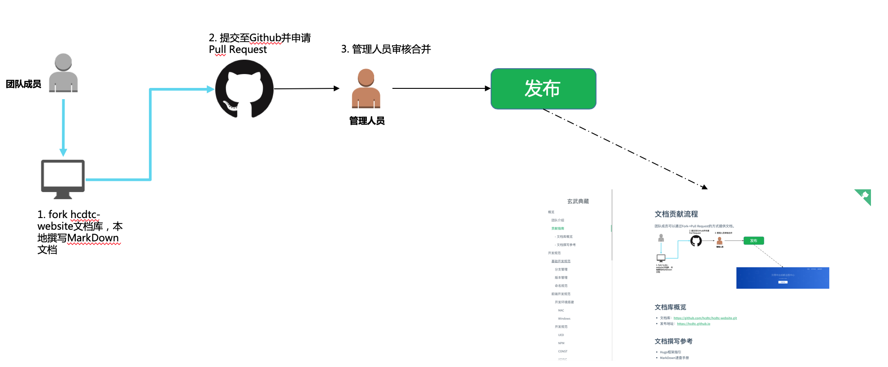
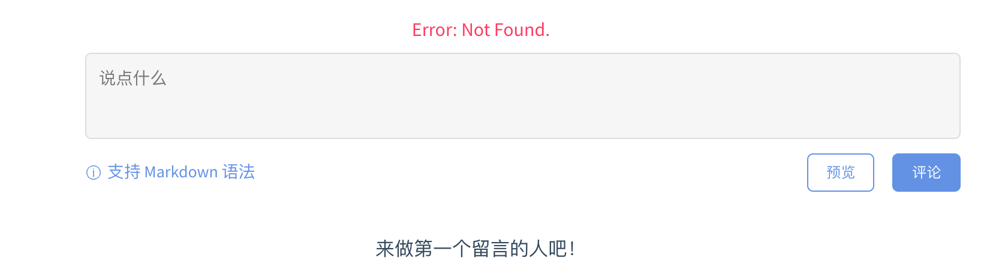

# 文档贡献流程

团队成员可以通过Fork->Pull Request的方式提供文档。


## 文档库概览

* 文档库：https://github.com/hcdtc/hcdtc-website.git
* 发布地址：https://hcdtc.github.io/hcdtc-website

## 文档撰写参考
本文档基于Docsify框架，主要采用Markdown编写。

* Docsify指南([Docsify](zh-cn/80-team/Docsify指南))
* Markdown速查手册([Markdown](zh-cn/80-team/Markdown指南))

## FAQ

* gittalk插件引入后，报错not found

问题分析：由于配置出现了问题，owner/admin都必须是仓库的用户。repo为仓库的名字。
```
  <script>
    const gitalk = new Gitalk({
      clientID: 'xxx',
      clientSecret: 'xxx',
      repo: 'hcdtc-website',
      owner: 'hcdtc',
      admin: ['hcdtc'],
      // facebook-like distraction free mode
      distractionFreeMode: false
    })
  </script>
```
