# 迭代开发流程

## 故事评审
产品经理根据发版规划确定迭代开发内容，编写开发内容文档，界面设计图。与技术负责人（组长）过详细业务逻辑、界面设计，技术负责人需从技术角度提出不合理的需求，提出优化逻辑及界面的建议。参会人员技术负责人、产品经理
- 确定迭代故事与逻辑

## 技术评审

### 编写技术设计文档
技术负责人（组长）根据故事评审会提出的迭代故事内容，编写表设计文档、技术设计文档。表设计当遵循项目制定表设计规范；技术设计文档需按照项目要求格式书写，对故事做拆分成接口，描述每个接口的具体逻辑、使用技术，给出每个接口的URL、请求类型，阐述界面每个字段对应数据库表中的字段，对于LOV、值集需给出CODE
1. 编写表设计EXCEL
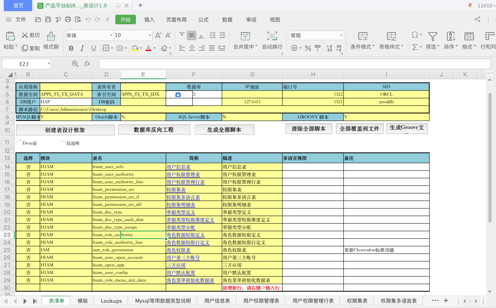

2. 编写技术设计文档
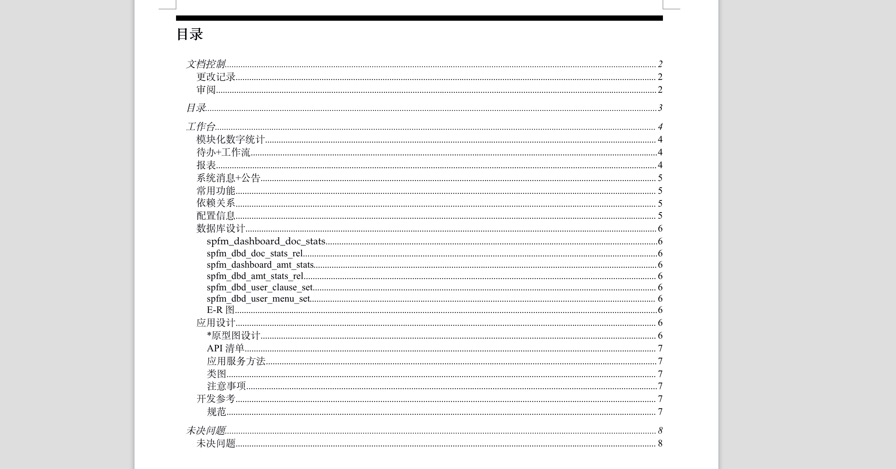

### 任务拆分
拆分故事任务，预估工时，提测时间，验收评审时间，并分配给开发人员。维护到迭代计划EXCEL
1. 维护迭代计划EXCEL
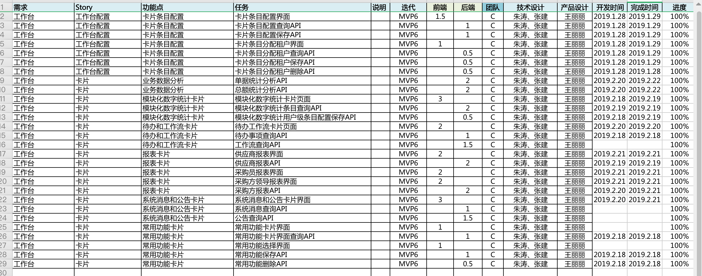

### 技术评审会
产品经理先大致说明迭代开发任务故事的背景逻辑，以及界面，技术负责人（组长）需讲明表结构、技术设计细节及实现逻辑。参会组员需思考逻辑是否正确并是否还可再优化，以及页面操作显示是否可再优化，可提出讨论。参会人员技术负责人、产品经理、组员、测试人员
- 讲解背景以及逻辑

## 迭代开发

### 猪齿鱼开启迭代
技术负责人创建冲刺，根据迭代计划excel维护故事、任务、工时、人员并开启冲刺
1. 开启冲刺
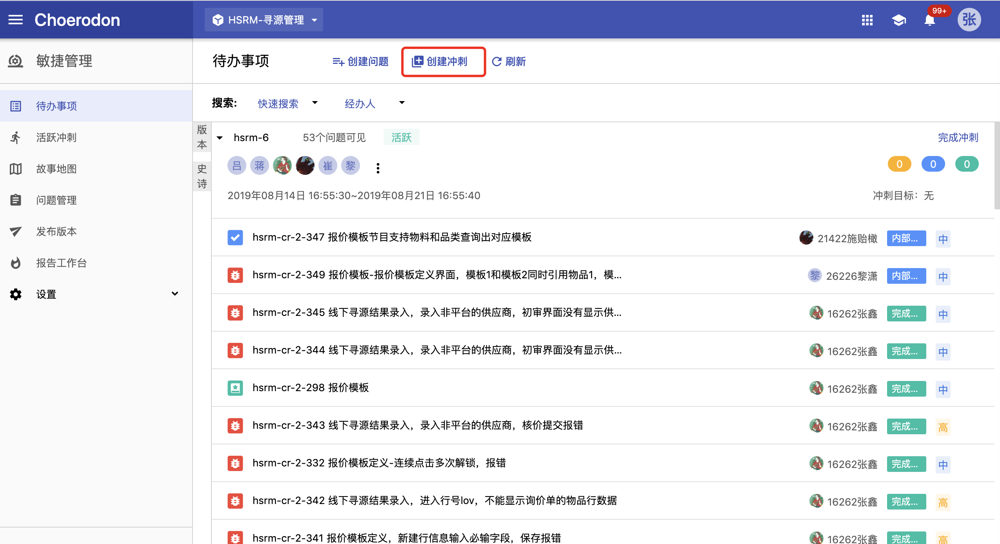

### 开发人员
开发人员根据分配任务合理安排开发计划，实时更新任务状态，让技术负责人能实时了解开发进度做好风险预警。开发人员根据表设计excel编写初始化表groovy脚本，也可通过代码生成器生成。对于表结构groovy脚本开发人员需在本地数据库跑脚本确定正常，由技术负责人统一初始化到开发环境数据库。对于表结构的修改需通过技术负责人确认，并必须在groovy脚本中写changset修改，同步修改表设计excel，开发员需在本地数据库验证groovy脚本工作正常，由技术负责人跑groovy脚本将更改更新到开发环境数据库。并维护开发中需要的各种数据配置
1. 实时更新看板任务状态
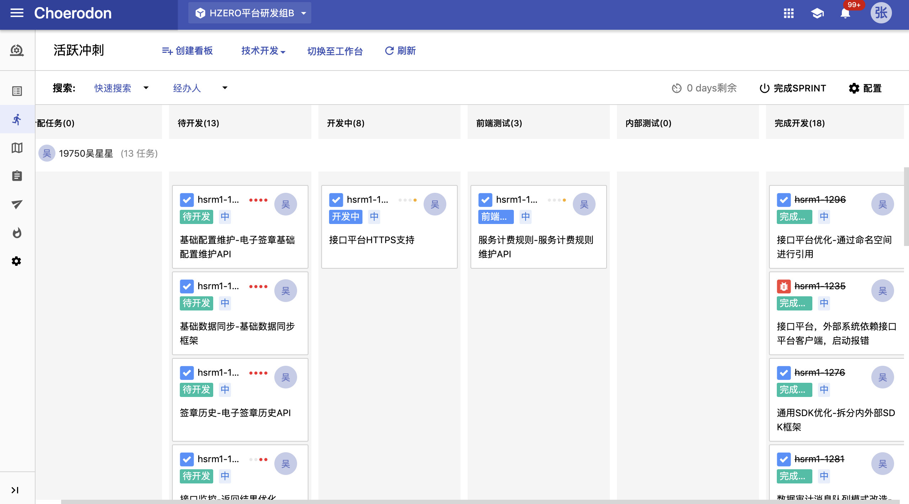

2. 通过代码生成器生成代码结构以及数据库groovy脚本，代码生成其生成的代码需要自己修改，保持结构即可。表结构的变更都需要通过Groovy脚本，并由技术负责人维护
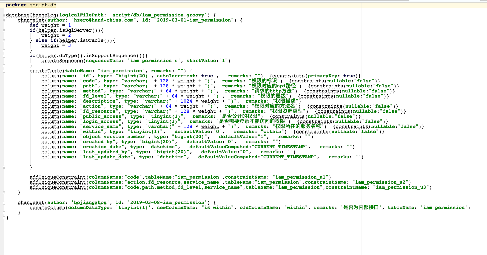

3. 维护编码规则Excel,编码规则可在平台配置，用于生成编码，如：订单编号等。技术负责人需检查Excel是否正确。开发人员在开发环境需通过Excel初始化编码规则，以验证Excel没有问题
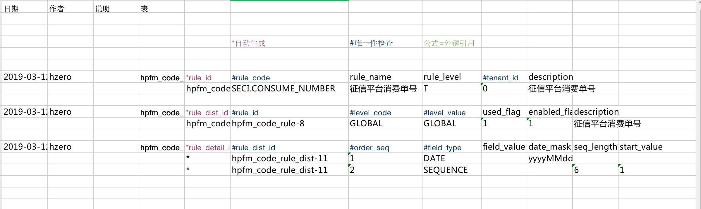

4. 维护LOV Excel，包括独立值集、LOV。技术负责人需检查Excel是否正确。开发人员在开发环境需通过Excel初始化编码规则，以验证Excel没有问题
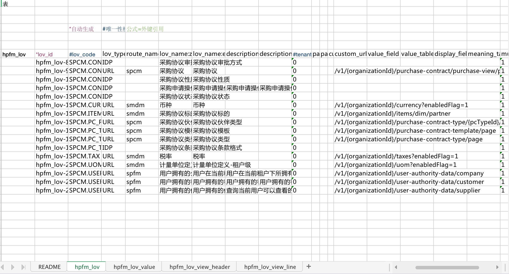

5. 数据权限维护，跨数据库连表查询需要加数据库前缀，可通过平台配置，给指定服务指定表添加指定服务。技术负责人需检查Excel是否正确。开发人员在开发环境需通过Excel初始化编码规则，以验证Excel没有问题
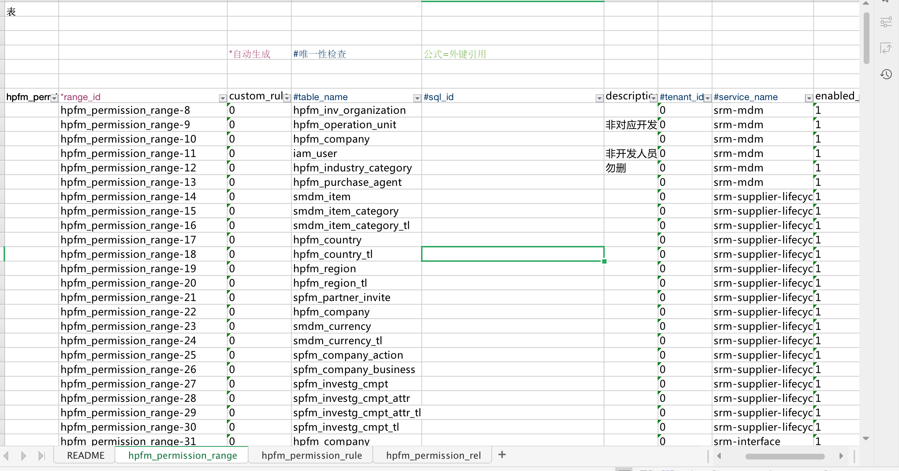

6. 通知维护，可以通过hzero-message服务发送短信、邮件、站内消息等信息。技术负责人需检查Excel是否正确。开发人员在开发环境需通过Excel初始化编码规则，以验证Excel没有问题
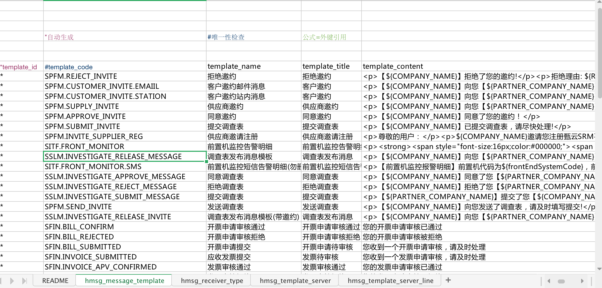

7. 前后端本地连调

### 早会
技术负责人主持，组员参与，在测试阶段测试人员也需要参与。技术负责人根据看板上每个人任务状态，询问昨天做的事以及今天计划做的事，技术负责人需要根据每个人的情况预估每个人能否按时间节点完成相应开发，如果存在阻塞问题或有延迟风险需要给出解决方案。在开发完测试人员入场测试，技术负责人需跟踪每个bug修改情况，尽量不要出现延迟较高的bug
1. 过开发进度，做好风险管控，迭代节奏控制

2. 在测试阶段需要询问测试人员测试进度，是否出现Bug太多导致测试进度缓慢，或阻塞性Bug。技术负责人需给出解决方案

3. 做好与产品经理沟通确保产出的功能逻辑是符合需求

4. 根据每个人的情况，灵活调整任务安排

### 自测
开发人员已将功能开发完成，并已配好各种数据。技术负责人需要与产品经理确认功能菜单层级以及权限，技术负责人维护菜单权限Excel，开发人员需要将自己开发的接口挂到相应权限集下，技术负责人将Excel中数据初始化到开发环境中，并调用相关接口使其生效。对于菜单权限的修改也必须通过Excel进行调整。迭代功能需在测试环境自测确保菜单权限没问题，基础数据已经维护好，没有明显报错，自测由相应开发人员执行，测试时间不要过长。组员自测完成后，技术负责人和产品经理需浏览一下看功能是否符合当初的设计
1. 维护菜单权限Excel
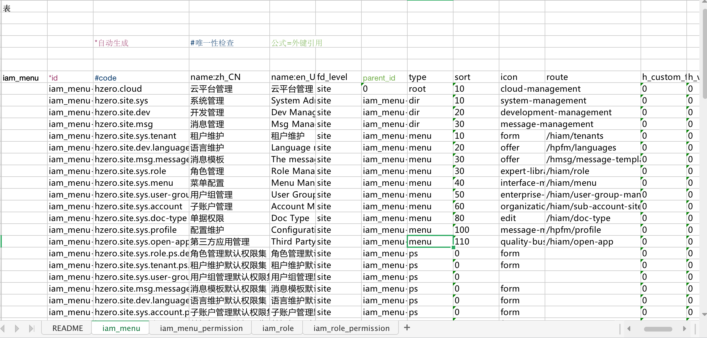

2. 将菜单权限Excel数据导入开发环境数据库

3. 对于有新增的菜单，需调用/v1/init/role-level-path初始化菜单 level_path

4. 对于有新增的权限集，需调用/v1/init/super-role-permission-sets将权限集挂到两个超级管理员下

5. 对于有新增的角色，需调用 [/v1/init/role-level-path] 初始化角色 level_path

6. 对内置角色分配的权限集，可调用 [/v1/init/inherited-role-permission-sets] 为继承树上的角色分配权限集

7. 组员自测功能

8. 技术负责人、产品经理确认开发功能是否符合当初设计

### 预发布环境
自测完成后，项目负责人需将代码合并到预发布环境，并维护菜单权限，基础数据，确保迭代功能在预发布环境可测
1. 合并代码到预发布环境

2. 维护菜单权限及基础数据

### 测试人员系统测试
预发布环境发布完成后测试人员入场，进行迭代功能的详细逻辑、界面、兼容性测试。技术负责人需控制测试进度，按时完成。测试人员测出的bug需维护到猪齿鱼看板上，并指给技术负责人，技术负责人将bug分配给相应开发人员
1. 测试人员入场进行系统测试

2. 维护bug，并给出具体bug信息，包括环境地址、账户密码、测试数据、必要截图

3. 技术负责人分配bug

4. 开发人员修复并指给测试人员

5. 测试人员验证回归bug

### 迭代评审会
测试人员测试完成后，就可进行迭代评审会，迭代评审会参会人员：项目负责人、技术负责人、开发人员、产品经理、测试人员，在会期间需要测试人员演示迭代成果，项目负责人验收迭代产出，对不符合需求或需要改进的地方提出意见并记录在会笔记中。会后由产品经理、测试提任务需求，技术负责人负责安排完成改进任务
1. 项目负责人验收迭代成果，给出改进意见

2. 产品经理、测试人员维护改进任务

3. 技术负责人负责改进任务的分配、完成

### 迭代回顾会
匿名收集开发人员在迭代中的想法，不限于工作。在迭代回顾会中解决提出的想法，改进迭代

