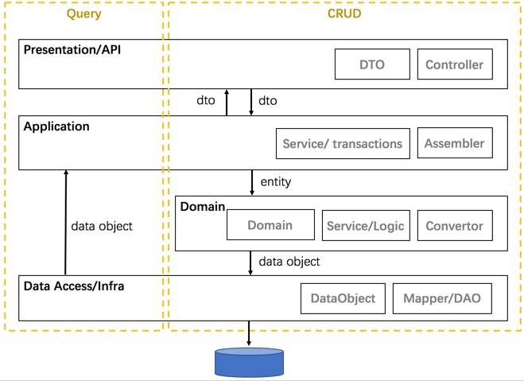

#  DDD代码结构规范
HZERO微服务遵循DDD领域驱动设计思想，整体架构如下：


从上往下整体分为四层：
## 展现层
主要用于用户显示信息，处理用户发送的restful请求信息（用户命令），并将信息传递给应用层的接口。这里指的用户可以是另一个计算机系统，不一定是使用用户界面的人。

在本系统实现程序上主要包括：
- controller 接受用户restful请求
- dto 封装用户请求的数据信息
- eventhandler 领域事件接收处理器
- validator 用户数据校验

## 应用层
完成展现层指定的任务，并且调用领域对象或服务来解决问题。这一层所负责的工作对业务来说意义重大，也是与其它系统的应用层进行交互的必要渠道。应用层要尽量简单，不包含业务规则或者知识，而只为下一层中的领域对象协调任务，分配工作，使它们互相协作。 在本系统实现程序上主要包括:
- assembler 对用户数据做转换
- service 根据业务调用领域对象或服务来组装实现业务逻辑
```txt
负责事务处理，所以事务的注解可以在这一层的service中使用。
只处理非业务逻辑，重点是调度业务处理流程。业务逻辑处理一定要放在领域层处理。
不做单元测试，只做验收测试。
可能会有比较多的依赖组件(领域服务)，使用field注入依赖的组件。
方法要求无状态，只接受dto和元数据类型作为参数。
```

## 领域模型层
负责表达业务概念，业务状态信息以及业务规则。尽管保存业务状态的技术细节是由基础设施层实现的，但是反映业务情况的状态是由本层控制并且使用的。领域层是业务软件的核心，领域模型位于这一层

在本系统实现程序上主要包括：
- entity 领域包含对象的属性和行为，领域需要提供自己的属性，并且要提供自己的行为。应用层可以调用领域行为实现业务逻辑
- repository 持久化接口，隔离具体持久化实现层，提供持久化功能
- service 领域服务负责多个领域对象之间的业务
- convertor 基础设施层对象转化类

## 基础设施层
向其他层提供通用的技术能力，为应用层传递消息，为领域层提供持久化机制，为用户界面层绘制屏幕组件，等等。基础设施层还能够通过架构框架来支持四个层次间的交互模式。 在本系统实现程序上主要包括：
- repository 持久化实现层，具体持久化实现逻辑、实现技术
- mapper mybatis映射接口
- feign 调用外部服务
- constant 常量
- utils 工具


