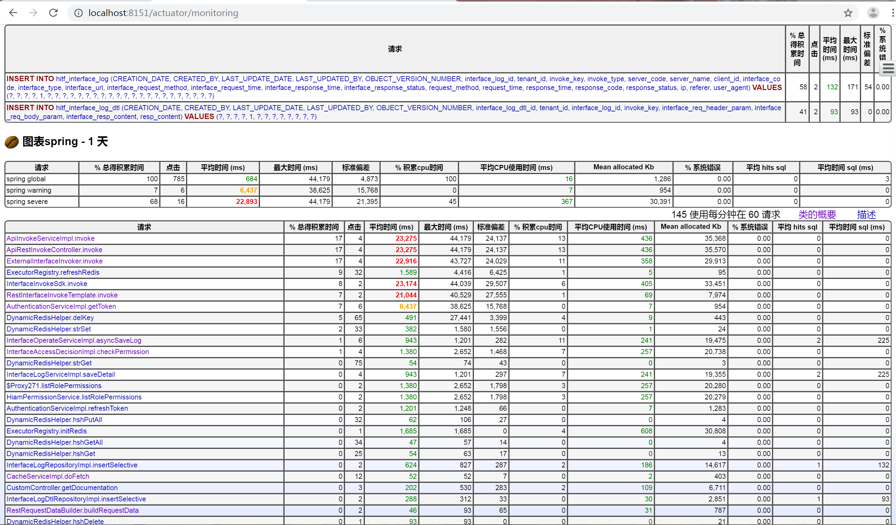

## 概述
hzero-interface服务基于Spring Boot 2.0.6.RELEASE开发实现，需要验证性能情况，因此，需要整合JavaMelody，监控调用信息。

> 搭建步骤参考[SpringBootStarter](https://github.com/javamelody/javamelody/wiki/SpringBootStarter)

## 1、增加maven依赖
```xml
    <properties>
        <javamelody.version>1.79.0</javamelody.version>
    </properties>

        <!-- JavaMelody @2019/8/28 by allen.liu -->
        <!-- 添加Tomcat-JDBC依赖 -->
        <dependency>
            <groupId>org.apache.tomcat</groupId>
            <artifactId>tomcat-jdbc</artifactId>
        </dependency>
        <dependency>
            <groupId>net.bull.javamelody</groupId>
            <artifactId>javamelody-spring-boot-starter</artifactId>
            <version>${javamelody.version}</version>
        </dependency>
```

> 为什么需要依赖`tomcat-jdbc`依赖？目前javamelody尚不支持hikari数据源，因此，需要本地开发切换至`tomcat-jdbc`数据源才可以使用。

## 2、配置管理端点（期望使用管理端点，而不是默认的端口）

- Maven依赖

```xml
<dependency>
    <groupId>org.springframework.boot</groupId>
    <artifactId>spring-boot-starter-actuator</artifactId>
</dependency>
```

- bootstrap.yml中配置管理端口及端点：

```yaml
management:
  server:
    port: 8151
  endpoints:
    web:
      exposure:
        include: info,health,monitoring
```

- `application-dev.yml`中配置JavaMelody，`仅在本地开发环境启用tomcat-jdbc数据源及javamelody监控工具`：

```yaml
spring:
  datasource:
    type: org.apache.tomcat.jdbc.pool.DataSource


javamelody:
  management-endpoint-monitoring-enabled: true
```

- `application.yml`中配置JavaMelody为`false`，设置为不启用，仍然使用`hikari`数据源

```yaml
javamelody:
  # Enable JavaMelody auto-configuration (optional, default: true)
  enabled: false
```

> 注意：需要使用tomcat数据源，目前javamelody还不支持hikari数据源，因此，需要特殊配置下数据源类型为tomcat。报错：com.sun.proxy.$Proxy117 cannot be cast to com.zaxxer.hikari.HikariDataSource…；参考：https://github.com/javamelody/javamelody/issues/837

## 3、自定义JavaMelody监控配置
- 可通过`JdkRegexpMethodPointcut.patterns`设置待监控的类，`excludedPatterns`设置排除类及方法的正则表达式
    - 注意：此处的正则表达式匹配的是`方法的完全限定名`
- 某些工具类设置了`私有构造函数`（例如，此处的ProfileClient、TemplateConfigClient），服务启动时，此处配置的监控动态代理将会报错，因此，需要特殊排除掉；也即，一般通过`patterns`设置一个大的监控范围，对于不适用的个例通过`excludedPatterns`进行排除

```java
@ComponentScan(value = {
    "org.hzero.interfaces.api",
    "org.hzero.interfaces.app",
    "org.hzero.interfaces.config",
    "org.hzero.interfaces.domain",
    "org.hzero.interfaces.infra",
})
@EnableFeignClients({"org.hzero", "io.choerodon"})
@EnableAspectJAutoProxy(proxyTargetClass = true, exposeProxy = true)
@EnableChoerodonResourceServer
@EnableObjectMapper
@Configuration
public class InterfaceAutoConfiguration {

    @Configuration
    @ConditionalOnProperty(prefix = "javamelody", name = "enabled", havingValue = "true")
    public static class JavaMelodyAutoConfiguration {
        @Bean
        JdkRegexpMethodPointcut javamelodyMonitoringPointcut() {
            String[] patterns = new String[]{
                    ".*\\.hzero\\..*",
                    ".*\\.controller\\..*",
                    ".*\\.service\\..*",
                    ".*\\.domain\\..*",
                    ".*\\.infra\\..*"
            };
            String [] excludePatterns = new String[] {
                    "org.hzero.boot.platform.profile.ProfileClient\\..*",
                    "org.hzero.boot.platform.templateconfig.TemplateConfigClient\\..*"
            };

            JdkRegexpMethodPointcut jdkRegexpMethodPointcut = new JdkRegexpMethodPointcut();
            jdkRegexpMethodPointcut.setPatterns(patterns);
            jdkRegexpMethodPointcut.setExcludedPatterns(excludePatterns);

            return jdkRegexpMethodPointcut;
        }

        @Bean
        MonitoringSpringAdvisor javamelodyMonitoringSpringAdvisor(JdkRegexpMethodPointcut javamelodyMonitoringPointcut) {
            return new MonitoringSpringAdvisor(javamelodyMonitoringPointcut);
        }
    }
}
```

## 4、本地验证
http://localhost:8151/actuator/monitoring



> 注意：虽然我们的服务是要注册到服务器端的eureka server中，并通过网关访问，但是管理端点确是可以通过本地部署服务器端口去访问的。