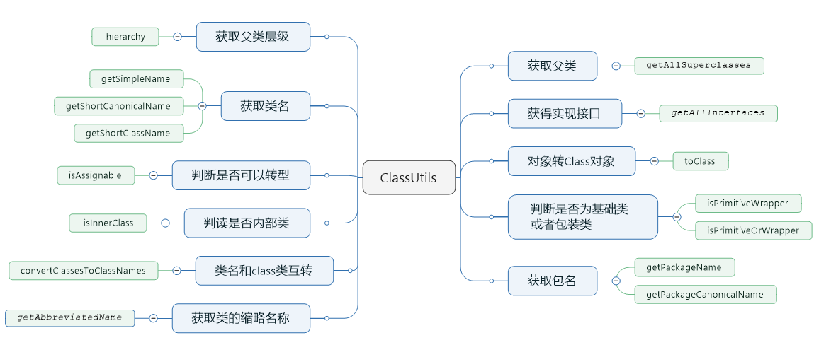

# ClassUtils 工具类使用

> 工具类：`org.apache.commons.lang3.ClassUtils`   
> 版本：`commons-lang3:3.7`  
> 地址：<a href="https://commons.apache.org/proper/commons-lang/javadocs/api-release/index.html" target="_blank">ClassUtils API</a>  
> 说明：`ClassUtils ` 是关于类级别相关的工具类，具有对类的简称`getShortClassName()`或`getSimpleName()`、获取所在包名称`getPackageName()`、获取所有父亲类集合`getAllSuperclasses()`、获取所有接口`getAllInterfaces()`、字符串集合到类集合转换`convertClassNamesToClasses()`、是否原始类判断`isPrimitiveOrWrapper()`、是否内部类判断`isInnerClass()`、通过类加载器获取class对象`getClass()`、获取Public方法`getPublicMethod()`、获取依赖集`hierarchy()`等操作方法

## 概览


## 获取包名
`getPackageName(Class<?> cls)`
``` java
//获取包名
String packageName = ClassUtils.getPackageName(String.class);
System.out.println(packageName);     // java.lang

//第一个参数为空,默认返回第二个参数
String packageName2 = ClassUtils.getPackageName(null, "the object is null");
System.out.println(packageName2);    // the object is null

//传入字符串
String packageName3 = ClassUtils.getPackageName("java.lang.String");
System.out.println(packageName3);    // java.lang

//获取规范名
String packageName4 = ClassUtils.getPackageCanonicalName(String.class);
System.out.println(packageName4);    // java.lang
```

## 获取类名

`getShortCanonicalName(Class<?> cls)`

`getShortClassName(Class<?> cls)`

`getSimpleName(Class<?> cls)`

``` java
//获取simpleName
String simpleName1 = ClassUtils.getSimpleName(String.class);
System.out.println(simpleName1); //  = String
    
//获取simpleName
String simpleName2 = ClassUtils.getSimpleName(null,"simpleName is null");
System.out.println(simpleName2); //  = simpleName is null
    
//获取canonicalName
String canonicalName = ClassUtils.getShortCanonicalName(String.class);
System.out.println(canonicalName); //  = String
    
//获取className
String className = ClassUtils.getShortClassName(String.class);
System.out.println(className); //  = String
    
//3者的区别：对于内部类，如内部类，区别就显示出来类
//其他情况区别不大
    
//获取simpleName
String simpleName3 = ClassUtils.getSimpleName(Map.Entry.class);
System.out.println(simpleName3); //  = Entry
    
//获取canonicalName
String canonicalName2 = ClassUtils.getShortCanonicalName(Map.Entry.class);
System.out.println(canonicalName2); //  = Map.Entry
    
//获取className
String className2 = ClassUtils.getShortClassName(Map.Entry.class);
System.out.println(className2); //  = Map.Entry
```

## 判断是否为转型
`isAssignable(Class<?> cls, Class<?> toClass)`

``` java
@Test
public void testIsAssignable(){
	//判断是否可以转型
	//= true
	System.out.println(ClassUtils.isAssignable(Date.class, Object.class));   
    //=false
    System.out.println(ClassUtils.isAssignable(Object.class, Date.class));    
}
```

## 判断是否为内部类
`isInnerClass(Class<?> cls)`

``` java
@Test
public void testIsInnerClass(){
	// = ture
	System.out.println(ClassUtils.isInnerClass(Entry.class)); 
	//= false
	System.out.println(ClassUtils.isInnerClass(Object.class)); 
}
```

## 判读是否为基础类型或者包装类型
`isPrimitiveOrWrapper(Class<?> type)`
`isPrimitiveWrapper(Class<?> type)`

``` java
@Test
public void testIsPrimitiveWrapper(){
    // wrapper类有(Boolean, Byte, Character, Short, Integer, Long, Double, Float).
    System.out.println(ClassUtils.isPrimitiveWrapper(Integer.class)); // = ture
    System.out.println(ClassUtils.isPrimitiveWrapper(Object.class)); // = false
    System.out.println(ClassUtils.isPrimitiveWrapper(String.class)); // = false
    System.out.println(ClassUtils.isPrimitiveWrapper(int.class)); // = false
    
    System.out.println(ClassUtils.isPrimitiveOrWrapper(Integer.class)); // = ture
    System.out.println(ClassUtils.isPrimitiveOrWrapper(Object.class)); // = false
    System.out.println(ClassUtils.isPrimitiveOrWrapper(String.class)); // = false
    System.out.println(ClassUtils.isPrimitiveOrWrapper(int.class)); // = true   
}
```

## 基础类型和包装类型转换
`wrapperToPrimitive(Class<?> cls)`
`primitiveToWrapper(Class<?> cls)`

``` java
 @Test
public void testWrapperToPrimitive(){
    // = int
    System.out.println(ClassUtils.wrapperToPrimitive(Integer.class));
    // = class java.lang.Integer
    System.out.println(ClassUtils.primitiveToWrapper(int.class));

}
```

## 获取类名和class类互转
`convertClassesToClassNames(List<Class<?>> classes)`

`convertClassNamesToClasses(List<String> classNames)`

``` java
List<Class<?>> list = new ArrayList<>();
list.add(Integer.class);
list.add(Object.class);
List<String> nameList = ClassUtils.convertClassesToClassNames(list);
// [java.lang.Integer, java.lang.Object]
System.out.println(nameList);

List<Class<?>> classList = ClassUtils.convertClassNamesToClasses(nameList);
//[class java.lang.Integer, class java.lang.Object]
System.out.println(classList);
```

## 对象转Class对象
`toClass(Object... array)`

``` java
@Test
public void testToClass(){
    //类转化为class对象
    Class[] classAry =  ClassUtils.toClass(new String(),new Object());
    // = {class java.lang.String,class java.lang.Object}
    System.out.println(ArrayUtils.toString(classAry));
}

```

## 获取缩略名
`getAbbreviatedName(Class<?> cls,int len)`          
`getAbbreviatedName(String className,int len)`

``` java
@Test
public void testGetAbbreviatedName(){
    //获取类的缩略名称
    String abbreviatedName1 = ClassUtils.getAbbreviatedName(String.class, 5);
    String abbreviatedName2 = ClassUtils.getAbbreviatedName(String.class, 10);
    String abbreviatedName3 = ClassUtils.getAbbreviatedName(String.class, 3);
    String abbreviatedName4 = ClassUtils.getAbbreviatedName(String.class, 20);
    System.out.println(abbreviatedName1); //j.l.String
    System.out.println(abbreviatedName2); //j.l.String
    System.out.println(abbreviatedName3); //j.l.String
    System.out.println(abbreviatedName4); //java.lang.String
}
```

## 获得所有实现的接口
`getAllInterfaces(Class<?> cls)`

``` java
@Test
public void testGetAllInterfaces(){
    //获得所有实现的接口
    List<Class<?>> classAry =  ClassUtils.getAllInterfaces(String.class);
    //[interface java.io.Serializable, interface java.lang.Comparable, interface java.lang.CharSequence]
    System.out.println(ArrayUtils.toString(classAry));
}
```

## 获取所有父类
`getAllSuperclasses(Class<?> cls)`

``` java
@Test
public void testGetAllSuperclasses(){
    //获得所有的父类
    List<Class<?>> classArray =  ClassUtils.getAllSuperclasses(String.class);
    //[class java.lang.Object]
    System.out.println(ArrayUtils.toString(classArray));

}
```

## 获取父类层级
`hierarchy(Class<?> type)`

``` java
@Test
public void testHierarchy(){
    Iterator<Class<?>> myIterator =  ClassUtils.hierarchy(ArrayList.class).iterator();
    while(myIterator.hasNext()){
        System.out.println(myIterator.next());
    }
}   

结果：
class java.util.ArrayList
class java.util.AbstractList
class java.util.AbstractCollection
class java.lang.Object
```