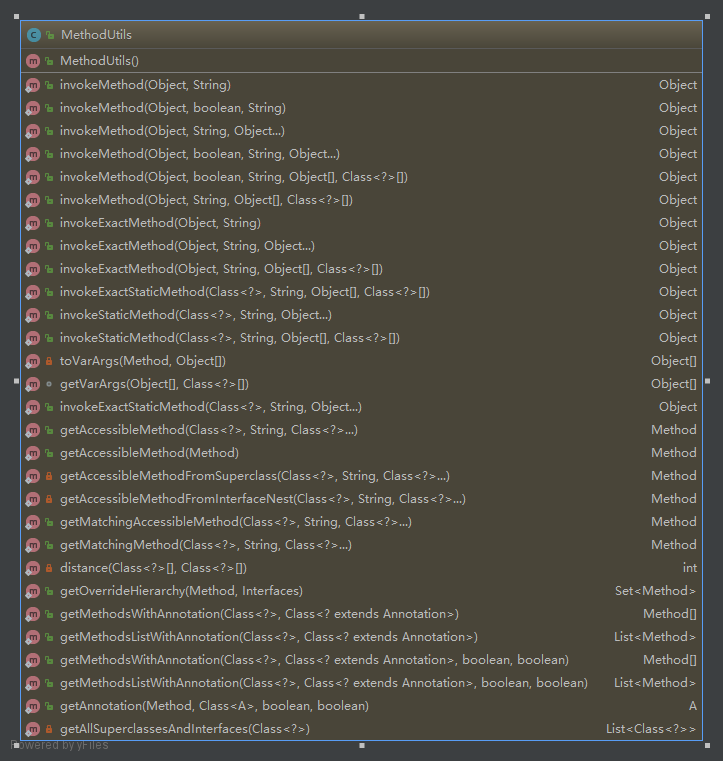

# MethodUtils工具类使用

> 类路径：`org.apache.commons.lang3.reflect.MethodUtils`<br/>
> 版本：`commons-lang3:3.7`  <br/>
> Java doc：<a href="http://commons.apache.org/proper/commons-lang/apidocs/org/apache/commons/lang3/reflect/MethodUtils.html" target="_blank">MethodUtils API</a><br/>
> 说明：`MethodUtils`是一个通过反射使用或者获取方法的工具类，它提供了各种获取以及使用方法的方法，甚至可以突破Java作用域的限制。<br/>

## MethodUtils类图


### 构造方法->MethodUtils
* **说明**：该工具类虽然提供了构造方法，但该构造方法**不应该**出现在标准程序中。提供公共构造方法是为了允许在有需要的时候提供`JavaBean`实例。

``` java
public MethodUtils()
``` 

### 反射执行类方法->invokeMethod

* 反射执行一个无参的方法

``` java
/**
* @param object 方法名所在的对象
* @param methodName 方法名
* @return 方法反射结果返回值
*/
public static Object invokeMethod(final Object object, final String methodName);
``` 

* 根据forceAccess参数判断反射执行时是否需要考虑Java作用域问题

``` java
/**
* @param object 方法名所在的对象
* @param forceAccess true为反射时无视Java方法作用域，false则相反
* @param methodName 方法名
* @return 方法反射结果返回值
*/
public static Object invokeMethod(final Object object, final boolean forceAccess, final String methodName);
```

* 反射执行一个有参的方法

``` java
/**
* @param object 方法名所在的对象
* @param methodName 方法名
* @param args 反射需要传入的参数，支持多个参数
* @return 方法反射结果返回值
*/
public static Object invokeMethod(final Object object, final String methodName,Object... args);
```

* 根据forceAccess参数判断反射执行有参的方法时是否需要考虑Java作用域问题

``` java
/**
* @param object 方法名所在的对象
* @param forceAccess true为反射时无视Java方法作用域，false则相反
* @param methodName 方法名
* @param args 反射需要传入的参数，支持多个参数
* @return 方法反射结果返回值
*/
public static Object invokeMethod(final Object object, final boolean forceAccess, final String methodName,Object... args);
```

* 根据forceAccess参数判断反射执行有参且指定参数类型的方法时是否需要考虑Java作用域问题，此方法适合用于方法重载中参数个数相同但参数类型不同的方法

``` java
/**
* @param object 方法名所在的对象
* @param forceAccess true为反射时无视Java方法作用域，false则相反
* @param methodName 方法名
* @param args 反射需要传入的参数，支持多个参数
* @param parameterTypes 当前方法参数的参数类型
* @return 方法反射结果返回值
*/
public static Object invokeMethod(final Object object, final boolean forceAccess, final String methodName,Object[] args, Class<?>[] parameterTypes);
```

* 反射执行有参且指定参数类型的方法，此方法适合用于方法重载中参数个数相同但参数类型不同的方法

``` java
/**
* @param object 方法名所在的对象
* @param methodName 方法名
* @param args 反射需要传入的参数，支持多个参数
* @param parameterTypes 当前方法参数的参数类型
* @return 方法反射结果返回值
*/
public static Object invokeMethod(final Object object, final String methodName,Object[] args, Class<?>[] parameterTypes);
```

### 精确的反射执行方法->invokeExactMethod

* 反射精确执行一个无参的方法

``` java
/**
* @param object 方法名所在的对象
* @param methodName 方法名
* @return 方法反射结果返回值
*/
public static Object invokeExactMethod(final Object object, final String methodName);
```

* 反射精确执行一个传入参数类型完全匹配传入方法的参数类型的方法

``` java
/**
* @param object 方法名所在的对象
* @param methodName 方法名
* @param args 参数值
* @return 方法反射结果返回值
*/
public static Object invokeExactMethod(final Object object, final String methodName,Object... args);
```

* 反射精确执行一个传入参数类型完全匹配传入方法的参数类型的方法

``` java
/**
* @param object 方法名所在的对象
* @param methodName 方法名
* @param args 参数值
* @param parameterTypes 参数类型
* @return 方法反射结果返回值
*/
public static Object invokeExactMethod(final Object object, final String methodName,Object... args,Class<?>[] parameterTypes);
```

### 反射精确执行静态方法->invokeExactStaticMethod

* 反射精确执行静态方法

``` java
/**
* @param cls 静态方法所在类的类型
* @param methodName 方法名
* @param args 参数值
* @param parameterTypes 参数类型
* @return 方法反射结果返回值
*/
public static Object invokeExactStaticMethod(final Class<?> cls, final String methodName,Object[] args, Class<?>[] parameterTypes);
```

* 反射精确执行静态方法

``` java
/**
* @param cls 静态方法所在类的类型
* @param methodName 方法名
* @param args 参数值
* @return 方法反射结果返回值
*/
public static Object invokeExactStaticMethod(final Class<?> cls, final String methodName,Object[] args);
```

### 反射执行静态方法->invokeStaticMethod

* 反射执行静态方法

``` java
/**
* @param cls 静态方法所在类的类型
* @param methodName 方法名
* @param args 参数值
* @return 方法反射结果返回值
*/
public static Object invokeStaticMethod(final Class<?> cls, final String methodName,Object[] args);
```

* 反射执行静态方法

``` java
/**
* @param cls 静态方法所在类的类型
* @param methodName 方法名
* @param args 参数值
* @param parameterTypes 参数类型
* @return 方法反射结果返回值
*/
public static Object invokeStaticMethod(final Class<?> cls, final String methodName,Object[] args, Class<?>[] parameterTypes);
```

### 得到一个能成功反射执行的方法->getAccessibleMethod

* 得到一个能成功反射执行的方法

``` java
/**
* @param cls 方法所在类的类型
* @param methodName 方法名
* @param parameterTypes 参数类型
* @return 方法
*/
public static Method getAccessibleMethod(final Class<?> cls, final String methodName,final Class<?>... parameterTypes);
```

* 得到一个能成功反射执行的方法，如果不符合，则返回null

``` java
/**
* @param method 方法
* @return 方法
*/
public static Method getAccessibleMethod(Method method);
```

### 根据方法名得到一个可以反射执行且参数类型兼容的方法->getMatchingAccessibleMethod

* 根据方法名得到一个可以反射执行且参数类型兼容的方法

``` java
/**
* @param cls 方法所在类的类型
* @param methodName 方法名
* @param parameterTypes 参数类型
* @return 方法
*/
public static Method getMatchingAccessibleMethod(final Class<?> cls,final String methodName, final Class<?>... parameterTypes);
```

### 得到一个方法->getMatchingMethod

* 得到一个方法

``` java
/**
* @param cls 方法所在类的类型
* @param methodName 方法名
* @param parameterTypes 参数类型
* @return 方法
*/
public static Method getMatchingMethod(final Class<?> cls, final String methodName,final Class<?>... parameterTypes);
```

### 获得一个方法的所有父级方法，直到接口->getOverrideHierarchy

* 获得一个方法的所有父级重写方法，直到接口方法

``` java
/**
* @param method 方法
* @param interfacesBehavior 寻找到的最终接口
* @return 所有重写的方法
*/
public static Set<Method> getOverrideHierarchy(final Method method, final Interfaces interfacesBehavior);
```

### 获取含有给定注解的所有方法->getMethodsListWithAnnotation

* 获取含有给定注解的所有方法

``` java
/**
* @param cls 方法所在类
* @param annotationCls 注解
* @param searchSupers 是否搜索父类
* @param ignoreAccess 是否无视作用域
* @return 符合条件的方法list
*/
public static List<Method> getMethodsListWithAnnotation(final Class<?> cls,final Class<? extends Annotation> annotationCls,final boolean searchSupers,final boolean ignoreAccess);
```

* 获取当前类中含有给定注解且能被反射执行的所有方法（List）

``` java
/**
* @param cls 方法所在类
* @param annotationCls 注解
* @return 方法list
*/
public static Method[] getMethodsListWithAnnotation(final Class<?> cls, final Class<? extends Annotation> annotationCls);
```

### 获取当前类中含有给定注解且能被反射执行的所有方法（数组）->getMethodsWithAnnotation

* 获取当前类中含有给定注解且能被反射执行的所有方法（数组）

``` java
/**
* @param cls 方法所在类
* @param annotationCls 注解
* @return 方法数组
*/
public static Method[] getMethodsWithAnnotation(final Class<?> cls, final Class<? extends Annotation> annotationCls);
```

* 获取当前类或当前类以及父类中含有给定注解且能否被反射执行的所有方法（数组）

``` java
/**
* @param cls 方法所在类
* @param annotationCls 注解
* @param searchSupers 是否搜索父类
* @param ignoreAccess 是否无视作用域
* @return 方法数组
*/
public static Method[] getMethodsWithAnnotation(final Class<?> cls, final Class<? extends Annotation> annotationCls,final boolean searchSupers, final boolean ignoreAccess);
```

### 得到方法上指定注解的注解对象->getAnnotation

* 得到方法上指定注解的注解对象

``` java
/**
* @param <A> 注解泛型
* @param method 方法
* @param annotationCls 注解类
* @param searchSupers 是否搜索父类
* @param ignoreAccess 是否无视作用域
* @return 第一次搜索到的注解对象
*/
public static <A extends Annotation> A getAnnotation(final Method method, final Class<A> annotationCls,final boolean searchSupers, final boolean ignoreAccess);
```