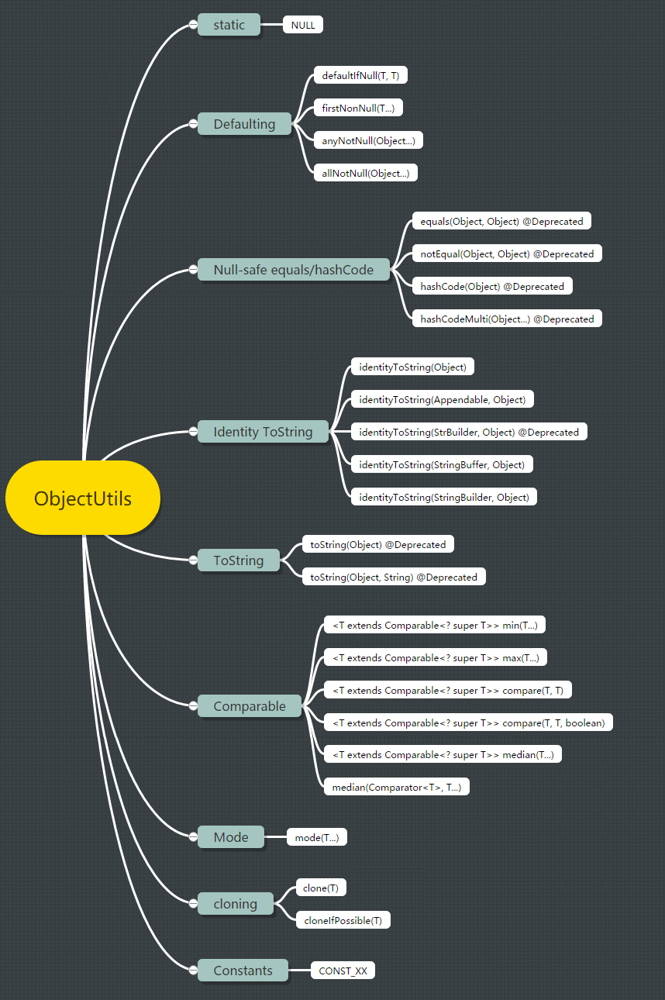

# ObjectUtils 工具类使用 

> 工具类：`org.apache.commons.lang3.ObjectUtils`  
> 版本：`commons-lang3:3.7`  
> 地址：[ObjectUtils API](https://commons.apache.org/proper/commons-lang/javadocs/api-release/org/apache/commons/lang3/ObjectUtils.html)  
> 说明：`ObjectUtils` 是处理对象常用操作的工具类，包含默认值、hash/equals(已废弃)、Object原生toString()、toString(已废弃)、比较、求最常出现值、克隆和内联常量编译优化几部分。

## 概览

## NULL常量

此常量为`ObjectUtils`内部类`org.apache.commons.lang3.ObjectUtils.Null`的一个实例，可以用来做`Hashtable`的键，用来代替不被接受的null。

## 默认值

### defaultIfNull(T, T)

如果传递的对象为null，则返回默认值。

表达式 | 值
:-- | --:
ObjectUtils.defaultIfNull(null,null)|null
ObjectUtils.defaultIfNull(null,"")|""
ObjectUtils.defaultIfNull(null,"zz")|"zz"
ObjectUtils.defaultIfNull("abc",*)|"abc"
ObjectUtils.defaultIfNull(Boolean.TRUE,*)|Boolean.TRUE

### firstNonNull(T...)

返回数组中非空的第一个值。 如果所有值都为null或数组为null或为空，则返回null。

表达式 | 值
:-- | --:
ObjectUtils.firstNonNull(null,null)|null
ObjectUtils.firstNonNull(null,"")|""
ObjectUtils.firstNonNull(null,null,"")|""
ObjectUtils.firstNonNull(null,"zz")|"zz"
ObjectUtils.firstNonNull("abc",*)|"abc"
ObjectUtils.firstNonNull(null,"xyz",*)|"xyz"
ObjectUtils.firstNonNull(Boolean.TRUE,*)|Boolean.TRUE
ObjectUtils.firstNonNull()|null

### anyNotNull(Object...)

检查给定数组中的任何值是否为空。如果所有值都为null或数组为null或为空，则返回false。 否则返回true。

表达式 | 值
:-- | --:
ObjectUtils.anyNotNull(*)|true
ObjectUtils.anyNotNull(*,null)|true
ObjectUtils.anyNotNull(null,*)|true
ObjectUtils.anyNotNull(null,null,*,*)|true
ObjectUtils.anyNotNull(null)|false
ObjectUtils.anyNotNull(null,null)|false

### allNotNull(Object...)

检查数组中的所有值是否都不为空。如果任何值为null或数组为null，则返回false。 如果数组中的所有元素都不为null或数组为空（不包含元素），则返回true。

表达式 | 值
:-- | --:
ObjectUtils.allNotNull(*)|true
ObjectUtils.allNotNull(*,*)|true
ObjectUtils.allNotNull(null)|false
ObjectUtils.allNotNull(null,null)|false
ObjectUtils.allNotNull(null,*)|false
ObjectUtils.allNotNull(*,null)|false
ObjectUtils.allNotNull(*,*,null,*)|false

## hash/equals

### equals(Object, Object) @Deprecated

比较两个对象是否相等，其中一个或两个对象可以为null。

请使用java7中引入的`java.util.Objects.equals(Object, Object)`

### notEqual(Object, Object) @Deprecated

比较两个对象是否不相等，其中一个或两个对象可以为null。

请使用java7中引入的`java.util.Objects.equals(Object, Object)`然后 **取反**

### hashCode(Object) @Deprecated

获取对象的哈希值，null -> 0

请使用java7中引入的`java.util.Objects.hashCode(Object)`

### hashCodeMulti(Object...) @Deprecated

获取多个对象的哈希值。与包含指定对象的ArrayList计算的哈希值相同。

请使用java7中引入的`java.util.Objects.hash(Object...)`

## Object原生toString()

### identityToString(Object)

模拟由Object生成的toString返回值。null将返回null。

表达式 | 值
:-- | --:
ObjectUtils.identityToString(null)|null
ObjectUtils.identityToString("")|"java.lang.String@1e23"
ObjectUtils.identityToString(Boolean.TRUE)|"java.lang.Boolean@7fa"

### identityToString(Appendable, Object)

模拟由Object生成的toString返回值并追加到Appendable对象尾部。两个参数都不能为空，否则抛出NPE。

表达式 | 等效表达式
:-- | --:
ObjectUtils.identityToString(appendable,"")|appendable.append("java.lang.String@1e23")
ObjectUtils.identityToString(appendable,Boolean.TRUE)|appendable.append("java.lang.Boolean@7fa")
ObjectUtils.identityToString(appendable,Boolean.TRUE)|appendable.append("java.lang.Boolean@7fa")

### identityToString(StrBuilder, Object) @Deprecated

模拟由Object生成的toString返回值并追加到StrBuilder对象尾部。两个参数都不能为空，否则抛出NPE。

由于StrBuilder对象已废弃，请使用本类中其他`identityToString`方法

### identityToString(StringBuffer, Object)

模拟由Object生成的toString返回值并追加到StringBuffer对象尾部。两个参数都不能为空，否则抛出NPE。

表达式 | 等效表达式
:-- | --:
ObjectUtils.identityToString(buf,"")|buf.append("java.lang.String@1e23")
ObjectUtils.identityToString(buf,Boolean.TRUE)|buf.append("java.lang.Boolean@7fa")
ObjectUtils.identityToString(buf,Boolean.TRUE)|buf.append("java.lang.Boolean@7fa")

### identityToString(StringBuilder, Object)

模拟由Object生成的toString返回值并追加到StringBuilder对象尾部。两个参数都不能为空，否则抛出NPE。

表达式 | 等效表达式
:-- | --:
ObjectUtils.identityToString(builder,"")|builder.append("java.lang.String@1e23")
ObjectUtils.identityToString(builder,Boolean.TRUE)|builder.append("java.lang.Boolean@7fa")
ObjectUtils.identityToString(builder,Boolean.TRUE)|builder.append("java.lang.Boolean@7fa")

## ToString

### toString(Object) @Deprecated

调用对象的toString方法并返回。空对象将返回""

请使用java7中引入的`java.util.Objects.toString(myObject, "")`

### toString(Object, String) @Deprecated

调用第一个参数对象的toString方法并返回。第一个参数对象为空将返回第二个参数对象

请使用java7中引入的`java.util.Objects.toString(Object, String)`

## 比较

### <T extends Comparable<? super T>> min(T...)

返回给定参数中的最小值，空值安全

表达式 | 值
:-- | --:
ObjectUtils.min(1,2,3,5,5,5,0) | 0
ObjectUtils.min(1,2,3,5,null,5,0) | 0
ObjectUtils.min() | null

### <T extends Comparable<? super T>> max(T...)

返回给定参数中的最大值，空值安全

表达式 | 值
:-- | --:
ObjectUtils.min(1,2,3,5,5,5,0) | 5
ObjectUtils.min(1,2,3,5,null,5,0) | 5
ObjectUtils.min() | null

### <T extends Comparable<? super T>> compare(T, T)

空值安全的常规比较，设第一个参数为a，第二个参数为b，如果a < b则为负值，如a = b则为零，如果a > b则为正值. 空值判定为比非空值小。

表达式 | 值
:-- | --:
ObjectUtils.compare(1, 2) | -1
ObjectUtils.compare(1, null) | 1
ObjectUtils.compare(null, null) | 0

### <T extends Comparable<? super T>> compare(T, T, boolean)

空值安全的常规比较，设第一个参数为a，第二个参数为b，如果a < b则为负值，如a = b则为零，如果a > b则为正值. 如果第三个参数为true，空值判定为比非空值大，否则反之。

表达式 | 值
:-- | --:
ObjectUtils.compare(1, null, true) | -1
ObjectUtils.compare(1, null, false) | 1
ObjectUtils.compare(null, null, false) | 0

### <T extends Comparable<? super T>> median(T...)

返回给定对象的中位数，如果给定对象的个数是偶数，则返回更小那个中位数。参数必传且不能有null值。

表达式 | 值
:-- | --:
ObjectUtils.median(1,2,3) | 2
ObjectUtils.median(1,2,3,4) | 2

### median(Comparator<T>, T...)

返回给定对象的中位数，如果给定对象的个数是偶数，则返回更小那个中位数。参数必传且不能有null值。排序过程使用给定比较器。比较器不能为空

例子：略

## 最常出现

### mode(T...)

返回给定参数中最常出现的值，参数必传。

表达式 | 值
:-- | --:
ObjectUtils.mode(1,2,3,3,3,4,5) | 3
ObjectUtils.mode(1,2,3,null,3,4,5) | 3
ObjectUtils.mode(1,2,null,null,3,null,5) | null

## 克隆

### clone(T)

克隆一个对象，如果对象没有实现`Cloneable`接口，则返回null。

表达式 | 值
:-- | --:
ObjectUtils.clone(new int[] {1,2,3,4,5}) | \[1,2,3,4,5\](新对象)
ObjectUtils.clone(new BitSet(1)) | {}(新对象)
ObjectUtils.clone(ObjectUtils.NULL) | null

### cloneIfPossible(T)

克隆一个对象，如果对象没有实现`Cloneable`接口，则返回传入对象自身。

表达式 | 值
:-- | --:
ObjectUtils.cloneIfPossible(new int[] {1,2,3,4,5}) | \[1,2,3,4,5\](新对象)
ObjectUtils.cloneIfPossible(new BitSet(1)) | {}(新对象)
ObjectUtils.cloneIfPossible(ObjectUtils.NULL) | ObjectUtils.NULL(自身)

## Constants

### CONST_XX系列方法

这一系列以CONST开头的方法，除了做最基本的类型校验没有其他逻辑，直接返回传入值。

以下摘自源码中的注释说明：

> 这些方法确保javac不会内联常量。  
> 例如，通常开发人员可能会声明一个常量，如：  
> `public final static int MAGIC_NUMBER = 5;`  
> 如果不同的jar包引用了这个常量，那么当MAGIC_NUMBER更改（例如，MAGIC_NUMBER = 6）后，之前生成的jar包会重新编译。 因为javac通常将字面量或String常量直接内联到字节码中，而不是直接引用MAGIC_NUMBER字段。  
> 为了减少不必要的重新编译，开发人员可以使用`CONST()`方法来声明它们的常量：  
> `public final static int MAGIC_NUMBER = CONST(5);`

可见，总体来说是用来优化编译器行为的。