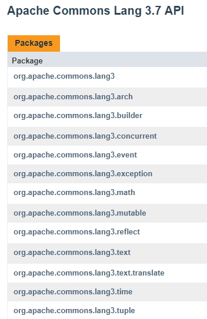
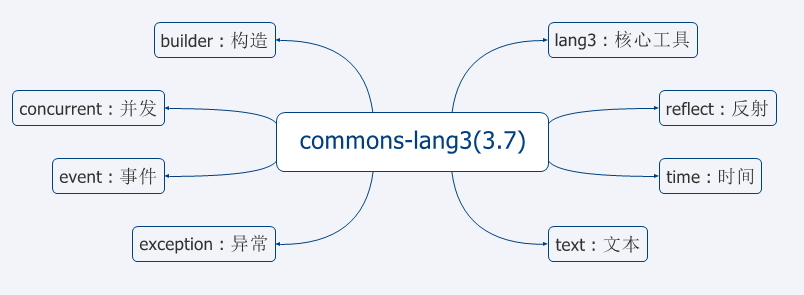

# common-lang3工具类
---
本文档详细介绍了common-lang3工具类。

在日常工作中，我们经常会使用到一些开源工具，比如`StringUtils`、`CollectionUtils`等。大多数时候我们并不清楚有这些工具类的存在，造成在开发过程中重新实现导致时间浪费，不仅重复造轮子，且开发的代码质量不佳。  
我们从使用最多的`commons-lang3`这个jar包开始探索一些常用的工具类及方法来帮助我们提高开发效率和代码质量。

## commons-lang3 包结构

