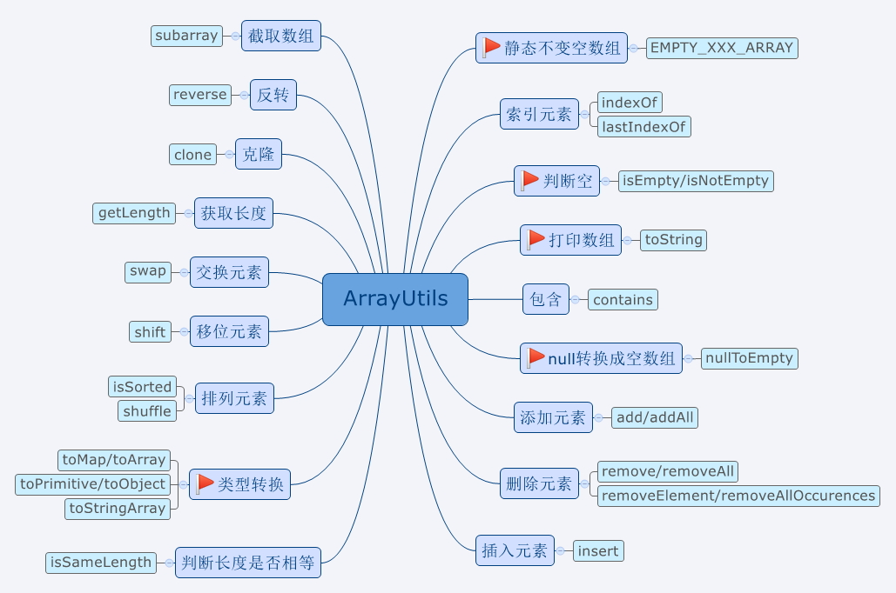
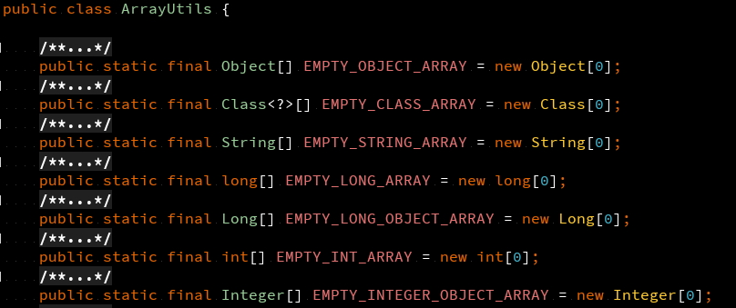

# ArrayUtils 工具类使用 

> 工具类：`org.apache.commons.lang3.ArrayUtils`   
> 版本：`commons-lang3:3.7`  
> 地址：<a href="https://commons.apache.org/proper/commons-lang/javadocs/api-release/index.html" target="_blank">ArrayUtils API</a>  
> 说明：`ArrayUtils` 是专门用来处理数组的工具类，每种类型的方法都包括8中原生数据类型和包装类型，以及`Object`、`Class`、`String`、`Character`等。可以优雅地处理空输入，而不会抛出异常，因此不必再判断一次是否为null。

## 概览



## 空数组常量

`ArrayUtils` 工具类一开始提供了空且不可变的数组常量，我们可以在需要返回空数组的地方使用这些已经定义好的数组，避免创建引用。



## 索引元素位置 IndexOf

``` java
@Test
public void testIndexOf () {
    String[] arr = new String[]{"aa", "bb", "cc", "bb", "cc"};

    System.out.println(ArrayUtils.indexOf(arr, "bb")); // 1  正序查找第一个匹配的元素
    System.out.println(ArrayUtils.indexOf(arr, "mm")); // -1  找不到元素返回 -1
    System.out.println(ArrayUtils.indexOf(arr, "bb", 2)); // 3  第三个参数指定起始位置

    System.out.println(ArrayUtils.lastIndexOf(arr, "bb")); // 3  倒序查找第一个匹配的元素
    System.out.println(ArrayUtils.lastIndexOf(arr, "mm")); // -1  找不到元素返回 -1
    System.out.println(ArrayUtils.lastIndexOf(arr, "bb", 2)); // 1  第三个参数指定起始位置，然后倒序查找匹配的元素
}
```
## 判空 isEmpty

``` java
@Test
public void testEmpty() {
    String[] arr = new String[]{"aa", "bb", "cc", "bb", "cc"};
    String[] arr2 = new String[]{};
    String[] arr3 = null;

    System.out.println(ArrayUtils.isEmpty(arr)); // false
    System.out.println(ArrayUtils.isEmpty(arr2)); // true
    System.out.println(ArrayUtils.isEmpty(arr3)); // true

    // isNotEmpty 的结果与 isEmpty 相反
}
```
## 打印数组 toString

``` java
@Test
public void testToString() {
    String[] arr = new String[]{"aa", "bb", "cc", "bb", "cc"};
    String[] arr2 = new String[]{};
    String[] arr3 = null;

    System.out.println(ArrayUtils.toString(arr)); // {aa,bb,cc,bb,cc}
    System.out.println(ArrayUtils.toString(arr2)); // {}
    System.out.println(ArrayUtils.toString(arr3)); // {}
}
```

## null转换成空数组 nullToEmpty

``` java
@Test
public void testNullToEmpty () {
    String[] arr = new String[]{"aa", "bb", "cc", "bb", "cc"};
    String[] arr2 = new String[]{};
    String[] arr3 = null;

    String[] arrT = ArrayUtils.nullToEmpty(arr);  // {aa,bb,cc,bb,cc}
    String[] arr2T = ArrayUtils.nullToEmpty(arr2); // {}
    String[] arr3T = ArrayUtils.nullToEmpty(arr3); // {}
}
```

## 添加元素 add

``` java
@Test
public void testAdd() {
    String[] arr = new String[]{"aa", "bb", "cc"};
    String[] arr2 = null;

    String[] arrT = ArrayUtils.add(arr, "dd"); // {aa,bb,cc,dd}  产生的是一个新的数组对象
    String[] arrT2 = ArrayUtils.add(arr, null); // {aa,bb,cc,<null>}
    String[] arr2T = ArrayUtils.add(arr2, "dd"); // {dd}
    String[] arr2T2 = ArrayUtils.add(arr2, null); // IllegalArgumentException: Arguments cannot both be null 抛出异常

    String[] arrAll = ArrayUtils.addAll(arr, "aa", null, "dd"); // {aa,bb,cc,aa,<null>,dd}
}
```

## 数组类型转换 

``` java
@Test
public void testChange() {

    // 将二维数组转换成Map
    Map colorMap = ArrayUtils.toMap(new String[][] {
            {"RED", "#FF0000"},
            {"GREEN", "#00FF00"},
            {"BLUE", "#0000FF"}});

    // 封装到数组
    String[] arr = ArrayUtils.toArray("aa", "bb", "cc");

    // 原生数组转换成包装类型数组
    Integer[] integerArr = ArrayUtils.toObject(new int[]{1 ,2, 3});

    // 包装类型数组转换成原生类型数组
    int[] intArr = ArrayUtils.toPrimitive(new Integer[]{1, 2, 3});

    // 对象转换成 String[]
    String[] strArr = ArrayUtils.toStringArray(new Integer[]{1,2,3});
}
```

