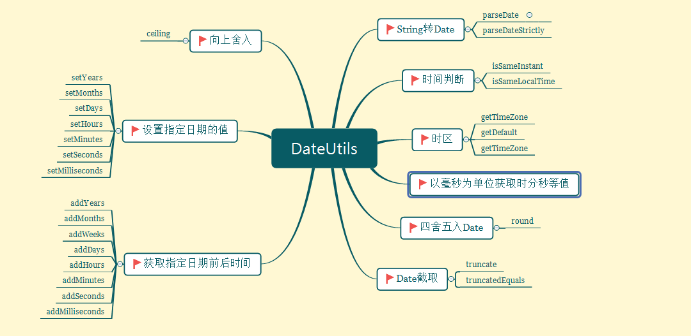
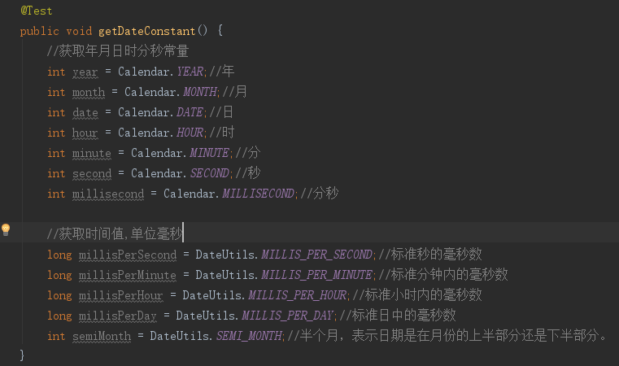

# DateUtils 工具类使用

> 工具类：`org.apache.commons.lang3.time.DateUtils`   
> 版本：`commons-lang3:3.7`
> 地址：<a href="https://commons.apache.org/proper/commons-lang/javadocs/api-release/index.html" target="_blank">DateUtils API</a>  
> 说明：`DateUtils` 是专门用来处日期工具类,提供String日期转换date,日期的设置,截取,比较,四舍五入以及当前时区获取,设置,等方法

## 概览



## DateUtils常量

`DateUtils` 定义了年月日时分秒常量 , 以毫秒为单位,年月日时分秒值



## String转Date 

`参数` arg0 : 日期字符串 String , arg1: 特定的地理，政治和文化地区.可以传null, arg3 : 日期格式.与arg0格式要保持一致String
``` java
  @Test
    public void testStringConvertDate() throws ParseException {
        //该方法对日期和时间的是宽松的(如 1996 年 2 月 42 日)将被视为等同于 1996 年 2 月 1 日后的第 41 天
        Date date1 = DateUtils.parseDate("20171012 14:30:12", Locale.TRADITIONAL_CHINESE, "yyyyMMdd hh:mm:ss");
        //该方法对日期和时间的解释是严格的 (如 1996 年 2 月 42 日)将会报错
        Date date2 = DateUtils.parseDateStrictly("20170202", Locale.TRADITIONAL_CHINESE, "yyyyMMdd");
    }
```
## 时间判断

``` java
 @Test
    public void testIfDate() throws ParseException {
        Date date1 = DateUtils.parseDate("20171012 14:30:12", Locale.ENGLISH, "yyyyMMdd hh:mm:ss");
        Date date2 = DateUtils.parseDate("20171012 14:30:12", Locale.TRADITIONAL_CHINESE, "yyyyMMdd hh:mm:ss");
        Calendar cal1 = Calendar.getInstance();
        cal1.setTime(date1);
        Calendar cal2 = Calendar.getInstance();
        cal2.setTime(date2);
        
        DateUtils.isSameInstant(date1, date2);//判断两个日期是不是同一毫秒
        DateUtils.isSameLocalTime(cal1, cal2);//判断是否是同一个本地的时间
    }
```
## 获取指定日期前后时间

``` java
 @Test
    public void testGetDate() throws ParseException {
        Date date1 = DateUtils.parseDate("20171012 14:30:12", Locale.ENGLISH, "yyyyMMdd hh:mm:ss");
        System.out.println(date1);
        Date date = DateUtils.addYears(date1, 1);//获取指定日期前后 arg 年 正数向后,负数向前
        date = DateUtils.addMonths(date1, 1);//获取指定日期前后 arg 月 ..
        date = DateUtils.addWeeks(date1, 1);//获取指定日期前后 arg 周 ..
        date = DateUtils.addDays(date1, 1);//获取指定日期前后 arg 天 ..
        date = DateUtils.addHours(date1, 4);//获取指定日期前后 arg 时 ..
        date = DateUtils.addMinutes(date1, 4);//获取指定日期前后 arg 分 ..
        date = DateUtils.addSeconds(date1, 4);//获取指定日期前后 arg 秒 ..
        date = DateUtils.addMilliseconds(date1, 4);//获取指定日期前后 arg 毫秒 ..
    }
```

## 设置指定日期的值

``` java
 @Test
     public void setDate() throws ParseException {
         Date date = null;
         SimpleDateFormat df = new SimpleDateFormat("yyyy-MM-dd HH:mm:ss");
         Date date1 = DateUtils.parseDate("20171012 14:30:12", Locale.ENGLISH, "yyyyMMdd hh:mm:ss");
         date = DateUtils.setYears(date1, 2008);//设置指定日期年的值
         date = DateUtils.setMonths(date1, 1);//设置指定日期月的值
         date = DateUtils.setDays(date1, 24);//设置指定日期月的值
         date = DateUtils.setHours(date1, 23);//设置指定小时的值
         date = DateUtils.setMinutes(date1, 56);//指定指定日期分钟的值
         date = DateUtils.setSeconds(date1, 14);//设置指定日期秒的值
         date = DateUtils.setMilliseconds(date1, 100);//设置指定毫秒的值
     }
```

## 时区

``` java
 @Test
    public void testGetTimeZone() {
       Date date1 = DateUtils.parseDate("20171012 14:30:12", Locale.ENGLISH, "yyyyMMdd hh:mm:ss");
       Calendar calendar = new GregorianCalendar();
       TimeZone timeZone = calendar.getTimeZone();//系统默认时区
       TimeZone timeZone1 = TimeZone.getDefault();//系统默认时区
       TimeZone timeZone2 = TimeZone.getTimeZone("Europe/Copenhagen");//设置系统时区
       Calendar cal4 = DateUtils.toCalendar(date1, timeZone2);//Date时区转换
    }
```

## 四舍五入date

``` java
 @Test
    public void testRound() throws ParseException {
        SimpleDateFormat simpleDateFormat = new SimpleDateFormat("yyyyMMdd hh:mm:ss");
        Date date1 = DateUtils.parseDate("20171012 14:30:31", Locale.ENGLISH, "yyyyMMdd hh:mm:ss");
        System.out.println(simpleDateFormat.format(date1));
        Date round = DateUtils.round(date1, Calendar.HOUR);//四舍五入date, arg时间, arg四舍五入的单位(时) 返回20171012 03:00:00
        System.out.println(simpleDateFormat.format(round));
    }
```

## Date截取

``` java
 @Test
    public void cutDate() throws ParseException {
        SimpleDateFormat simpleDateFormat = new SimpleDateFormat("yyyyMMdd hh:mm:ss");
        Date date = DateUtils.parseDate("20171012 14:30:31", Locale.ENGLISH, "yyyyMMdd hh:mm:ss");
        System.out.println(simpleDateFormat.format(date));
        Date truncate = DateUtils.truncate(date, Calendar.HOUR);//截取给定规则截取date   arg日期,arg时
        System.out.println(simpleDateFormat.format(truncate));

        Date date1 = DateUtils.parseDate("20171012 14:29:31", Locale.ENGLISH, "yyyyMMdd hh:mm:ss");
        Date date2 = DateUtils.parseDate("20171012 13:29:30", Locale.ENGLISH, "yyyyMMdd hh:mm:ss");
        boolean b = DateUtils.truncatedEquals(date1, date2, Calendar.HOUR);//按照给定时间单位,去截取传入date , 再比较date
        System.out.println(b);

    }
```

## Date向上舍入

``` java
 @Test
     public void testUpRound() throws ParseException {
         SimpleDateFormat simpleDateFormat = new SimpleDateFormat("yyyyMMdd hh:mm:ss");
         Date date = DateUtils.parseDate("20171012 14:29:31", Locale.ENGLISH, "yyyyMMdd hh:mm:ss");
         System.out.println(simpleDateFormat.format(date));
         Date truncate = DateUtils.ceiling(date, Calendar.YEAR);//根据给定规则来向上舍入
         System.out.println(simpleDateFormat.format(truncate));
     }
```

