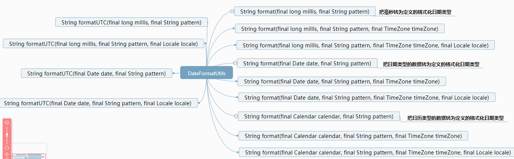

# DateFormatUtils 工具类使用
> 工具类：`org.apache.commons.lang3.time.DateFormatUtils`   
> 版本：`commons-lang3:3.7`  
> 地址：<a href="https://commons.apache.org/proper/commons-lang/javadocs/api-release/index.html" target="_blank">DateFormatUtils API</a>  
> 说明：`DateFormatUtils` 是专门用来处理日期格式转换的工具类，支持 `milliseconds`、`Date`、`Calendar` 转换为自定义的日期格式。
## 概述


## 预定义的日期格式
```java
public static final FastDateFormat ISO_8601_EXTENDED_DATETIME_FORMAT
            = FastDateFormat.getInstance("yyyy-MM-dd'T'HH:mm:ss");

public static final FastDateFormat ISO_8601_EXTENDED_DATETIME_TIME_ZONE_FORMAT
            = FastDateFormat.getInstance("yyyy-MM-dd'T'HH:mm:ssZZ");

public static final FastDateFormat ISO_8601_EXTENDED_DATE_FORMAT
            = FastDateFormat.getInstance("yyyy-MM-dd");

public static final FastDateFormat ISO_8601_EXTENDED_TIME_FORMAT
            = FastDateFormat.getInstance("HH:mm:ss");

public static final FastDateFormat ISO_8601_EXTENDED_TIME_TIME_ZONE_FORMAT
            = FastDateFormat.getInstance("HH:mm:ssZZ");

public static final FastDateFormat SMTP_DATETIME_FORMAT
            = FastDateFormat.getInstance("EEE, dd MMM yyyy HH:mm:ss Z", Locale.US);
```
## 使用 `DateFormatUtils`进行日期格式转换

```java
//把毫秒转为定义的格式化日期类型
String format = DateFormatUtils.format(1000000L, "yyyy-MM-dd HH:mm:ss");
System.out.println(format);
//把毫秒转为定义的格式化日期类型 + 时区
String format3 = DateFormatUtils.format(1000000L, "yyyy-MM-dd HH:mm:ss", TimeZone.getTimeZone("UTC"));
System.out.println(format3);
//把毫秒转为定义的格式化日期类型 + 地区
String format4 = DateFormatUtils.format(1000000L, "yyyy-MM-dd HH:mm:ss", Locale.ENGLISH);
System.out.println(format4);

//把日期类型转为定义的格式化日期类型
String format5 = DateFormatUtils.format(new Date(), "yyyy-MM-dd HH:mm:ss");
System.out.println(format5);
//把日期类型转为定义的格式化日期类型 + 时区
String format6 = DateFormatUtils.format(new Date(), "yyyy-MM-dd HH:mm:ss", TimeZone.getTimeZone("UTC"));
System.out.println(format6);
//把日期类型转为定义的格式化日期类型 + 地区
String format7 = DateFormatUtils.format(new Date(), "yyyy-MM-dd HH:mm:ss", Locale.ENGLISH);
System.out.println(format7);
//把日期类型转为定义的格式化日期类型 + 地区+ 时区
String format8 = DateFormatUtils.format(new Date(), "yyyy-MM-dd HH:mm:ss", TimeZone.getTimeZone("UTC"), Locale.CHINA);
System.out.println(format8);

//把日历类型转为定义的格式化日期类型
String format9 = DateFormatUtils.format(Calendar.getInstance(), "yyyy-MM-dd HH:mm:ss");
System.out.println(format9);
//把日历类型转为定义的格式化日期类型 + 时区
String format10 = DateFormatUtils.format(Calendar.getInstance(), "yyyy-MM-dd HH:mm:ss", TimeZone.getTimeZone("UTC"));
System.out.println(format10);
//把日历类型转为定义的格式化日期类型 + 地区
String format11 = DateFormatUtils.format(Calendar.getInstance(), "yyyy-MM-dd HH:mm:ss", Locale.ENGLISH);
System.out.println(format11);
//把日历类型转为定义的格式化日期类型 + 地区+ 时区
String format12 = DateFormatUtils.format(Calendar.getInstance(), "yyyy-MM-dd HH:mm:ss", TimeZone.getTimeZone("UTC"), Locale.CHINA);
System.out.println(format12);

//把毫秒转为UTC时区下的格式化日期类型
String format13 = DateFormatUtils.formatUTC(1000000L, "yyyy-MM-dd");
System.out.println(format13);
//把日期类型转为UTC时区下的格式化日期类型
String format14 = DateFormatUtils.formatUTC(new Date(), "yyyy-MM-dd");
System.out.println(format14);
//把毫秒转为UTC时区下的格式化日期类型+地区
String format15 = DateFormatUtils.formatUTC(1000000L, "yyyy-MM-dd", Locale.CHINA);
System.out.println(format15);
//把日期类型转为UTC时区下的格式化日期类型+地区
String format16 = DateFormatUtils.formatUTC(new Date(), "yyyy-MM-dd", Locale.CHINA);
System.out.println(format16);
```