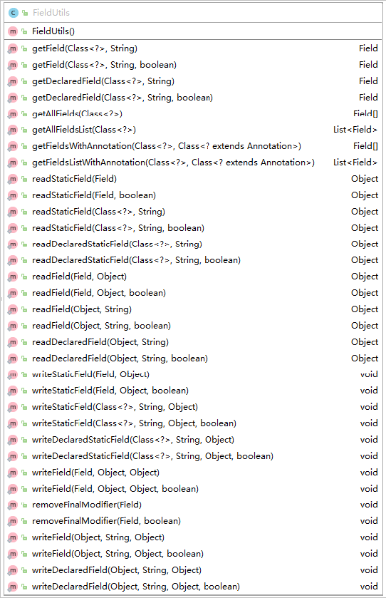

# FieldUtils 工具类使用

> 类路径：`org.apache.commons.lang3.reflect.FieldUtils`<br/>
> 版本：`commons-lang3:3.7`  <br/>
> Java doc：<a href="http://commons.apache.org/proper/commons-lang/apidocs/org/apache/commons/lang3/reflect/FieldUtils.html" target="_blank">FieldUtils API</a><br/>
> 说明：`FieldUtils`是一个通过反射处理字段的实用工具类，它提供的方法超出了普通编码的范围，可以修改**不应该**修改的字段，应该谨慎使用该工具类<br/>

## FieldUtils 类图



### 构造方法

* **说明**：该工具类虽然提供了构造方法，但该构造方法**不应该**出现在标准程序中。提供公共构造方法是为了允许在有需要的时候提供`JavaBean`实例。

```java
FieldUtils()
```

### 获取类字段

* 返回指定类以及**父类(如果有)**中的所有字段，以数组格式返回

```java
/**
 *
 * @param cls 查询的类，不允许为空
 * @return 返回一个字段数组(可能为空).
 * @throws IllegalArgumentException 类为null时抛出无效参数异常
 */
static Field[] getAllFields(Class<?> cls)
```

* 返回指定类以及**父类(如果有)**中的所有字段，以List格式返回

```java
/**
 *
 * @param cls 查询的类，不允许为空
 * @return 返回一个字段列表(可能为空).
 * @throws IllegalArgumentException 类为null时抛出无效参数异常
 */
static List<Field> getAllFieldsList(Class<?> cls)
```

* 通过字段名称获取指定类中一个可访问范围内的字段

```java
/**
 *
 * @param cls 查询的类，不允许为空
 * @param fieldName 字段名称
 * @return 字段对象
 * @throws IllegalArgumentException 类为null时抛出无效参数异常
 */
static Field getDeclaredField(Class<?> cls, String fieldName)
```

* 通过字段名称强制(如果需要)获取指定类中一个字段

```java
/**
 * @param cls 查询的类，不允许为空
 * @param fieldName 字段名称
 * @param forceAccess 是否强制访问(参考 java.lang.reflect.AccessibleObject#setAccessible(boolean))
 * @return 字段对象
 * @throws IllegalArgumentException 类为null时抛出无效参数异常
 */
static Field getDeclaredField(final Class<?> cls, final String fieldName, final boolean forceAccess)
```

* 通过字段名称获取指定类及其**父类**中的一个可访问范围内的字段

```java
/**
 *
 * @param cls 查询的类，不允许为空
 * @param fieldName 字段名称
 * @return 字段对象
 * @throws IllegalArgumentException 类为null时抛出无效参数异常
 */
static Field getField(Class<?> cls, String fieldName)
```

* 通过字段名称强制(如果需要)获取指定类及其**父类**中的一个字段

```java
/**
 * @param cls 查询的类，不允许为空
 * @param fieldName 字段名称
 * @param forceAccess 是否强制访问(参考 java.lang.reflect.AccessibleObject#setAccessible(boolean))
 * @return 字段对象
 * @throws IllegalArgumentException 类为null时抛出无效参数异常
 */
static Field getField(final Class<?> cls, final String fieldName, final boolean forceAccess)
```

* 通过指定注解获取指定类及其**父类**中的一个字段，以列表形式返回

```java
/**
 * @param cls 查询的类，不允许为空
 * @param annotationCls 查询的注解，该注解必须允许在字段上使用
 * @return 字段列表(可能为空)
 * @throws IllegalArgumentException 注解为null时抛出无效参数异常
 */
static List<Field>	getFieldsListWithAnnotation(Class<?> cls, Class<? extends Annotation> annotationCls)
```

* 通过指定注解获取指定类及其**父类**中的一个字段，以数组形式返回

```java
/**
 * @param cls 查询的类，不允许为空
 * @param annotationCls 查询的注解，该注解必须允许在字段上使用
 * @return 字段数组(可能为空)
 * @throws IllegalArgumentException 注解为null时抛出无效参数异常
 */
static Field[]	getFieldsWithAnnotation(Class<?> cls, Class<? extends Annotation> annotationCls)
```

### 读取字段值

* 通过字段名称读取指定类中的公有字段

```java
/**
 * @param target 目标对象
 * @param fieldName 字段名称
 * @return 字段值
 * @throws IllegalArgumentException 如果对象为null，或者字段名称为空或者找不到，抛出无效参数异常
 * @throws IllegalAccessException 如果字段不是公有，抛出无效访问异常
 */
static Object readDeclaredField(Object target, String fieldName)
```

* 通过字段名称强制读取指定类中的字段

```java
/**
 * @param target 目标对象
 * @param fieldName 字段名称
 * @param forceAccess 是否强制访问(参考 java.lang.reflect.AccessibleObject#setAccessible(boolean))
 * @return 字段值
 * @throws IllegalArgumentException 如果对象为null，或者字段名称为空或者找不到，抛出无效参数异常
 * @throws IllegalAccessException 如果字段不是公有，并且没有设置强制访问，抛出无效访问异常
 */
static Object readDeclaredField(Object target, String fieldName, boolean forceAccess)
```

* 通过字段名称读取指定类中的静态字段

```java
/**
 * @param cls 查询的类，不允许为空
 * @param fieldName 字段名称
 * @return 字段值
 * @throws IllegalArgumentException 如果类为null，或者字段名称为空或者找不到，抛出无效参数异常
 * @throws IllegalAccessException 如果字段不是公有，抛出无效访问异常
 */
static Object readDeclaredStaticField(Class<?> cls, String fieldName)
```

* 通过字段名称强制读取指定类中的静态字段

```java
/**
 * @param cls 查询的类，不允许为空
 * @param fieldName 字段名称
 * @param forceAccess 是否强制访问(参考 java.lang.reflect.AccessibleObject#setAccessible(boolean))
 * @return 字段值
 * @throws IllegalArgumentException 如果类为null，或者字段名称为空或者找不到，抛出无效参数异常
 * @throws IllegalAccessException 如果字段不是公有，并且没有设置强制访问，抛出无效访问异常
 */
static Object readDeclaredStaticField(Object target, String fieldName, boolean forceAccess)
```

* 通过字段对象读取指定类中及其**父类**中的公有字段

```java
/**
 * @param field 字段对象
 * @param target 目标对象
 * @return 字段值
 * @throws IllegalArgumentException 如果目标对象为null，或者字段对象为null，抛出无效参数异常
 * @throws IllegalAccessException 如果字段不是公有，抛出无效访问异常
 */
static Object readField(Field field, Object target)
```

* 通过字段对象强制读取指定类及其**父类**中的字段

```java
/**
 * @param field 字段对象
 * @param target 目标对象
 * @param forceAccess 是否强制访问(参考 java.lang.reflect.AccessibleObject#setAccessible(boolean))
 * @return 字段值
 * @throws IllegalArgumentException 如果目标对象为null，或者字段对象为null，抛出无效参数异常
 * @throws IllegalAccessException 如果字段不是公有，并且没有设置强制访问，抛出无效访问异常
 */
static Object readField(Field field, Object target, boolean forceAccess)
```

* 通过字段名称读取指定类中及其**父类**中的公有字段

```java
/**
 * @param target 目标对象
 * @param fieldName 字段名称
 * @return 字段值
 * @throws IllegalArgumentException 如果对象为null，或者字段名称为空或者找不到，抛出无效参数异常
 * @throws IllegalAccessException 如果字段不是公有，抛出无效访问异常
 */
static Object readField(Object target, String fieldName)
```

* 通过字段名称强制读取指定类及其**父类**中的字段

```java
/**
 * @param target 目标对象
 * @param fieldName 字段名称
 * @param forceAccess 是否强制访问(参考 java.lang.reflect.AccessibleObject#setAccessible(boolean))
 * @return 字段值
 * @throws IllegalArgumentException 如果对象为null，或者字段名称为空或者找不到，抛出无效参数异常
 * @throws IllegalAccessException 如果字段不是公有，并且没有设置强制访问，抛出无效访问异常
 */
static Object readField(Object target, String fieldName, boolean forceAccess)
```

* 通过字段名称读取指定类及其**父类**中的静态字段

```java
/**
 * @param cls 查询的类，不允许为空
 * @param fieldName 字段名称
 * @return 字段值
 * @throws IllegalArgumentException 如果类为null，或者字段名称为空或者找不到，抛出无效参数异常
 * @throws IllegalAccessException 如果字段不是公有，抛出无效访问异常
 */
static Object readStaticField(Class<?> cls, String fieldName)
```

* 通过字段名称强制读取指定类及其**父类**中的静态字段

```java
/**
 * @param cls 查询的类，不允许为空
 * @param fieldName 字段名称
 * @param forceAccess 是否强制访问(参考 java.lang.reflect.AccessibleObject#setAccessible(boolean))
 * @return 字段值
 * @throws IllegalArgumentException 如果类为null，或者字段名称为空或者找不到，抛出无效参数异常
 * @throws IllegalAccessException 如果字段不是公有，并且没有设置强制访问，抛出无效访问异常
 */
static Object readStaticField(Object target, String fieldName, boolean forceAccess)
```

* 读取公有静态字段

```java
/**
 * @param field 字段对象
 * @return 字段值
 * @throws IllegalArgumentException 如果字段为null，抛出无效参数异常
 * @throws IllegalAccessException 如果字段不是公有，抛出无效访问异常
 */
static Object readStaticField(Field field)
```

* 强制读取静态字段

```java
/**
 * @param field 字段对象
 * @param forceAccess 是否强制访问(参考 java.lang.reflect.AccessibleObject#setAccessible(boolean))
 * @return 字段值
 * @throws IllegalArgumentException 如果字段为null，抛出无效参数异常
 * @throws IllegalAccessException 如果字段不是公有，并且没有设置强制访问，抛出无效访问异常
 */
static Object readStaticField(Field field, boolean forceAccess)
```

### 删除字段`final`修饰符

* 删除公有字段`final`修饰符

```java
/**
 * @param field 字段对象
 * @throws IllegalArgumentException 如果字段为null，抛出无效参数异常
 */
static void	removeFinalModifier(Field field)
```

* 强制删除字段`final`修饰符

```java
/**
 * @param field 字段对象
 * @param forceAccess 是否强制访问(参考 java.lang.reflect.AccessibleObject#setAccessible(boolean))
 * @throws IllegalArgumentException 如果字段为null，抛出无效参数异常
 */
static void	removeFinalModifier(Field field, boolean forceAccess)
```

### 设置字段值

* 通过字段名称设置指定类中的公有字段值

```java
/** 
 * @param target 目标对象
 * @param fieldName 字段名称
 * @param value 字段值
 * @throws IllegalArgumentException 如果类为null，或者字段名称为空或者找不到，或者字段值没有分配，抛出无效参数异常
 * @throws IllegalAccessException 如果字段不是公有，抛出无效访问异常
 */
static void	writeDeclaredField(Object target, String fieldName, Object value)
```

* 通过字段名称强制设置指定类中的字段值

```java
/** 
 * @param target 目标对象
 * @param fieldName 字段名称
 * @param value 字段值
 * @param forceAccess 是否强制访问(参考 java.lang.reflect.AccessibleObject#setAccessible(boolean))
 * @throws IllegalArgumentException 如果类为null，或者字段名称为空或者找不到，或者字段值没有分配，抛出无效参数异常
 * @throws IllegalAccessException 如果字段不是公有，并且没有设置强制访问，抛出无效访问异常
 */
static void	writeDeclaredField(Object target, String fieldName, Object value, boolean forceAccess)
```

* 通过字段名称设置指定类中的静态字段值

```java
/** 
 * @param cls 设置的类，不允许为空
 * @param fieldName 字段名称
 * @param value 字段值
 * @throws IllegalArgumentException 如果类为null，或者字段名称为空或者找不到，或者字段值没有分配，抛出无效参数异常
 * @throws IllegalAccessException 如果字段不是公有，抛出无效访问异常
 */
static void	writeDeclaredStaticField(Class<?> cls, String fieldName, Object value)
```

* 通过字段名称强制设置指定类中的静态字段值

```java
/** 
 * @param cls 设置的类，不允许为空
 * @param fieldName 字段名称
 * @param value 字段值
 * @param forceAccess 是否强制访问(参考 java.lang.reflect.AccessibleObject#setAccessible(boolean))
 * @throws IllegalArgumentException 如果类为null，或者字段名称为空或者找不到，或者字段值没有分配，抛出无效参数异常
 * @throws IllegalAccessException 如果字段不是公有，并且没有设置强制访问，抛出无效访问异常
 */
static void	writeDeclaredStaticField(Class<?> cls, String fieldName, Object value, boolean forceAccess)
```

* 通过字段对象设置指定类及其**父类**中的公有字段值

```java
/** 
 * @param field 字段对象
 * @param target 目标对象
 * @param value 字段值
 * @throws IllegalArgumentException 如果类为null，或者字段为null，或者字段值没有分配，抛出无效参数异常
 * @throws IllegalAccessException 如果字段不是公有，抛出无效访问异常
 */
static void	writeField(Field field, Object target, Object value)
```

* 通过字段对象强制设置指定类及其**父类**中的字段值

```java
/** 
 * @param field 字段对象
 * @param target 目标对象
 * @param value 字段值
 * @param forceAccess 是否强制访问(参考 java.lang.reflect.AccessibleObject#setAccessible(boolean))
 * @throws IllegalArgumentException 如果类为null，或者字段为null，或者字段值没有分配，抛出无效参数异常
 * @throws IllegalAccessException 如果字段不是公有，并且没有设置强制访问，抛出无效访问异常
 */
static void	writeField(Field field, Object target, Object value, boolean forceAccess)
```

* 通过字段名称设置指定类及其**父类**中的公有字段值

```java
/** 
 * @param target 目标对象
 * @param fieldName 字段名称
 * @param value 字段值
 * @throws IllegalArgumentException 如果类为null，或者字段名称为空或者找不到，或者字段值没有分配，抛出无效参数异常
 * @throws IllegalAccessException 如果字段不是公有，抛出无效访问异常
 */
static void	writeField(Object target, String fieldName, Object value)
```

* 通过字段名称强制设置指定类及其**父类**中的字段值

```java
/** 
 * @param target 目标对象
 * @param fieldName 字段名称
 * @param value 字段值
 * @param forceAccess 是否强制访问(参考 java.lang.reflect.AccessibleObject#setAccessible(boolean))
 * @throws IllegalArgumentException 如果类为null，或者字段名称为空或者找不到，或者字段值没有分配，抛出无效参数异常
 * @throws IllegalAccessException 如果字段不是公有，并且没有设置强制访问，抛出无效访问异常
 */
static void	writeField(Object target, String fieldName, Object value, boolean forceAccess)
```

* 通过字段名称设置指定类及其**父类**中的静态字段值

```java
/** 
 * @param cls 设置的类，不允许为空
 * @param fieldName 字段名称
 * @param value 字段值
 * @throws IllegalArgumentException 如果类为null，或者字段名称为空或者找不到，或者字段值没有分配，抛出无效参数异常
 * @throws IllegalAccessException 如果字段不是公有，抛出无效访问异常
 */
static void	writeStaticField(Class<?> cls, String fieldName, Object value)
```

* 通过字段名称强制设置指定类及其**父类**中的静态字段值

```java
/** 
 * @param cls 设置的类，不允许为空
 * @param fieldName 字段名称
 * @param value 字段值
 * @param forceAccess 是否强制访问(参考 java.lang.reflect.AccessibleObject#setAccessible(boolean))
 * @throws IllegalArgumentException 如果类为null，或者字段名称为空或者找不到，或者字段值没有分配，抛出无效参数异常
 * @throws IllegalAccessException 如果字段不是公有，并且没有设置强制访问，抛出无效访问异常
 */
static void	writeStaticField(Class<?> cls, String fieldName, Object value, boolean forceAccess)
```

* 设置公有静态字段的值

```java
/** 
 * @param field 字段对象
 * @param value 字段值
 * @throws IllegalArgumentException 如果字段为null，或者字段值没有分配，抛出无效参数异常
 * @throws IllegalAccessException 如果字段不是公有，抛出无效访问异常
 */
static void	writeStaticField(Field field, Object value)
```

* 强制设置静态字段的值

```java
/** 
 * @param field 字段对象
 * @param value 字段值
 * @param forceAccess 是否强制访问(参考 java.lang.reflect.AccessibleObject#setAccessible(boolean))
 * @throws IllegalArgumentException 如果字段为null，或者字段值没有分配，抛出无效参数异常
 * @throws IllegalAccessException 如果字段不是公有，并且没有设置强制访问，抛出无效访问异常
 */
static void	writeStaticField(Field field, Object value, boolean forceAccess)
```

### 使用示例

```java
static class Parent {
    public static final Integer PARENT_ID = 0;
    private static final String PARENT_NAME = "PARENT";
    private Integer parentId = 0;
    public String parentName = "PARENT";
    @DateTimeFormat
    private Date parentBorn = new Date();
}

static class Child extends Parent {
    public static final Integer CHILD_ID = 1;
    private static final String CHILD_NAME = "CHILD";
    private Integer childId = 1;
    public String childName = "CHILD";
    @DateTimeFormat
    public Date childBorn = new Date();
}

@Test
@DisplayName("FieldUtils 工具类 - 获取类字段")
void getFieldTest() {
    FieldUtils.getAllFields(Child.class);
    /* Field[10]
     * 0 = {Field} "public static final java.lang.Integer x.x.AppTest$Child.CHILD_ID"
     * 1 = {Field} "private static final java.lang.String x.x.AppTest$Child.CHILD_NAME"
     * 2 = {Field} "private java.lang.Integer x.x.AppTest$Child.childId"
     * 3 = {Field} "public java.lang.String x.x.AppTest$Child.childName"
     * 4 = {Field} "public java.util.Date x.x.AppTest$Child.childBorn"
     * 5 = {Field} "public static final java.lang.Integer x.x.AppTest$Parent.PARENT_ID"
     * 6 = {Field} "private static final java.lang.String x.x.AppTest$Parent.PARENT_NAME"
     * 7 = {Field} "private java.lang.Integer x.x.AppTest$Parent.parentId"
     * 8 = {Field} "public java.lang.String x.x.AppTest$Parent.parentName"
     * 9 = {Field} "private java.util.Date x.x.AppTest$Parent.parentBorn"
     */
    FieldUtils.getAllFieldsList(Child.class);
    /* ArrayList size = 10
     * 0 = {Field} "public static final java.lang.Integer x.x.AppTest$Child.CHILD_ID"
     * 1 = {Field} "private static final java.lang.String x.x.AppTest$Child.CHILD_NAME"
     * 2 = {Field} "private java.lang.Integer x.x.AppTest$Child.childId"
     * 3 = {Field} "public java.lang.String x.x.AppTest$Child.childName"
     * 4 = {Field} "public java.util.Date x.x.AppTest$Child.childBorn"
     * 5 = {Field} "public static final java.lang.Integer x.x.AppTest$Parent.PARENT_ID"
     * 6 = {Field} "private static final java.lang.String x.x.AppTest$Parent.PARENT_NAME"
     * 7 = {Field} "private java.lang.Integer x.x.AppTest$Parent.parentId"
     * 8 = {Field} "public java.lang.String x.x.AppTest$Parent.parentName"
     * 9 = {Field} "private java.util.Date x.x.AppTest$Parent.parentBorn"
     */

    FieldUtils.getDeclaredField(Parent.class, "parentName");
    // public java.lang.String x.x.AppTest$Parent.parentName
    FieldUtils.getDeclaredField(Child.class, "parentName");
    // null (只读取当前类字段)
    FieldUtils.getDeclaredField(Parent.class, "parentId");
    // null (不可访问)

    FieldUtils.getDeclaredField(Parent.class, "parentId", true);
    // private java.lang.Integer x.x.AppTest$Parent.parentId

    FieldUtils.getField(Child.class, "parentId");
    // null (不可访问)
    FieldUtils.getField(Child.class, "parentId", true);
    // private java.lang.Integer x.x.AppTest$Parent.parentId

    FieldUtils.getFieldsWithAnnotation(Child.class, DateTimeFormat.class);
    /* Field[2]
     * 0 = {Field@1549} "public java.util.Date x.x.AppTest$Child.childBorn"
     * 1 = {Field@1550} "private java.util.Date x.x.AppTest$Parent.parentBorn"
     */
    FieldUtils.getFieldsListWithAnnotation(Child.class, DateTimeFormat.class);
    /* ArrayList size = 2
     * 0 = {Field@1549} "public java.util.Date x.x.AppTest$Child.childBorn"
     * 1 = {Field@1550} "private java.util.Date x.x.AppTest$Parent.parentBorn"
     */
}

@Test
@DisplayName("FieldUtils 工具类 - 读取类字段值")
void readFieldTest() throws IllegalAccessException {
    Child child = new Child();
    FieldUtils.readDeclaredField(child, "parentId");
    // java.lang.IllegalArgumentException: Cannot locate declared field class x.x.AppTest$Child.parentId (只读取当前类)
    FieldUtils.readDeclaredField(child, "childId");
    // java.lang.IllegalArgumentException: Cannot locate declared field class x.x.AppTest$Child.childId (不可访问)
    FieldUtils.readDeclaredField(child, "childName");
    // CHILD
    FieldUtils.readDeclaredField(child, "CHILD_NAME");
    // java.lang.IllegalArgumentException: Cannot locate declared field class x.x.AppTest$Child.CHILD_NAME (不能读取静态字段)
    FieldUtils.readDeclaredField(child, "childId", true);
    // 1

    FieldUtils.readDeclaredStaticField(Child.class, "CHILD_NAME");
    // java.lang.IllegalArgumentException: Cannot locate declared field x.x.AppTest$Child.CHILD_NAME (不可访问)
    FieldUtils.readDeclaredStaticField(Child.class, "CHILD_ID");
    // 1

    FieldUtils.readDeclaredStaticField(Child.class, "CHILD_NAME", true);
    // CHILD

    FieldUtils.readField(child, "parentId");
    // java.lang.IllegalArgumentException: Cannot locate field parentId on class x.x.AppTest$Child (不可访问)

    FieldUtils.readField(child, "parentId", true);
    // 1

    FieldUtils.readField(FieldUtils.getField(Parent.class, "parentId", true), child);
    // 0
}

@Test
@DisplayName("FieldUtils 工具类 - 设置类字段值")
void writeFieldTest() throws IllegalAccessException {
    Child child = new Child();
    FieldUtils.writeField(child, "parentId", 2);
    // java.lang.IllegalArgumentException: Cannot locate declared field x.x.AppTest$Child.parentId (不可访问)

    FieldUtils.writeField(child, "parentId", 2, true);
    // (设置成功)
    FieldUtils.writeField(child, "parentId", "PARENT_NAME", true);
    // java.lang.IllegalArgumentException: Can not set java.lang.Integer field x.x.AppTest$Parent.parentId to java.lang.String (类型转换错误)

    Field field = FieldUtils.getField(Child.class, "CHILD_NAME", true);
    FieldUtils.writeStaticField(field, "CHILD_NAME2", true);
    // java.lang.IllegalAccessException: Can not set static final java.lang.String field x.x.AppTest$Child.CHILD_NAME to java.lang.String (不可设置final字段)
    FieldUtils.removeFinalModifier(field, true);
    // (移除final修饰符)
    FieldUtils.writeStaticField(field, "CHILD_NAME2", true);
    // (设置成功)
    FieldUtils.readStaticField(field);
    // CHILD_NAME2
}
```