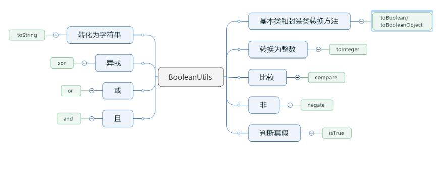

# BooleanUtils 工具类使用 

> 工具类：`org.apache.commons.lang3.BooleanUtils`   
> 版本：`commons-lang3:3.7`  
> 地址：<a href="https://commons.apache.org/proper/commons-lang/javadocs/api-release/index.html" target="_blank">BooleanUtils API</a>  
> 说明：`BooleanUtils` 用来操作基础布尔或者布尔对象。可以优雅地处理空输入，而不会抛出异常。

## 概览



## 布尔工具类


###  比较两个布尔值并返回int类型 如果x == y返回0， !x && y 返回小于 0 ，x && !y 返回大于0
#### compare(boolean x, boolean y)
#### isFalse(Boolean bool) 是否是假并返回boolean

#### isTrue(Boolean bool) 是否是真并返回boolean

#### isFalse(Boolean bool) negate(Boolean bool) 逻辑非

```java
BooleanUtils.negate(Boolean.TRUE)  = Boolean.FALSE;
BooleanUtils.negate(Boolean.FALSE) = Boolean.TRUE;
BooleanUtils.negate(null)          = null;
```


###  逻辑与
#### and(boolean... array)

```java
BooleanUtils.and(true, true)         = true
BooleanUtils.and(false, false)       = false
BooleanUtils.and(true, false)        = false
BooleanUtils.and(true, true, false)  = false
BooleanUtils.and(true, true, true)   = true

```


###  逻辑或
####  or(boolean... array)
```java
BooleanUtils.or(true, true)          = true
BooleanUtils.or(false, false)        = false
BooleanUtils.or(true, false)         = true
BooleanUtils.or(true, true, false)   = true
BooleanUtils.or(true, true, true)    = true
BooleanUtils.or(false, false, false) = false
```

###  异或
#### xor(boolean... array)
```java
BooleanUtils.xor(true, true)   = false
BooleanUtils.xor(false, false) = false
BooleanUtils.xor(true, false)  = true

```

###  将对象类型转换为基本数据类型并返回
#### toBoolean(Boolean bool)
```java
BooleanUtils.toBoolean(Boolean.TRUE)  = true
BooleanUtils.toBoolean(Boolean.FALSE) = false
BooleanUtils.toBoolean(null)          = false

```
###  将int类型转换为boolean类型并返回
#### toBoolean(int value)
```java
BooleanUtils.toBoolean(0) = false
BooleanUtils.toBoolean(1) = true
BooleanUtils.toBoolean(2) = true

```

###  将string类型转换为boolean类型并返回
#### toBoolean(String str)

```java
BooleanUtils.toBoolean(null)    = false
BooleanUtils.toBoolean("true")  = true
BooleanUtils.toBoolean("TRUE")  = true
BooleanUtils.toBoolean("tRUe")  = true
BooleanUtils.toBoolean("on")    = true
BooleanUtils.toBoolean("yes")   = true
BooleanUtils.toBoolean("false") = false
BooleanUtils.toBoolean("x gti") = false
BooleanUtils.toBooleanObject("y") = true
BooleanUtils.toBooleanObject("n") = false
BooleanUtils.toBooleanObject("t") = true
BooleanUtils.toBooleanObject("f") = false

```
### 将boolean类型数据转换为int类型并返回
##### toInteger(boolean bool)
```java
BooleanUtils.toInteger(true)  = 1
BooleanUtils.toInteger(false) = 0

```
###  将boolean类型数据转换为String类型'on' or 'off'并返回
#### toStringOnOff(boolean bool)
```java
BooBooleanUtils.toStringOnOff(true)   = "on"
   BooleanUtils.toStringOnOff(false)  = "off"


```


###  将boolean类型数据转换为String类型''true' or 'false'并返回
#### toStringTrueFalse(Boolean bool)
```java
BooleanUtils.toStringTrueFalse(true)   = "true"
BooleanUtils.toStringTrueFalse(false)  = "false"


```

###  将boolean类型数据转换为String类型'yes' or 'no'并返回
#### toStringYesNo(boolean bool)
```java
BooleanUtils.toStringYesNo(true)   = "yes"
BooleanUtils.toStringYesNo(false)  = "no"
```


