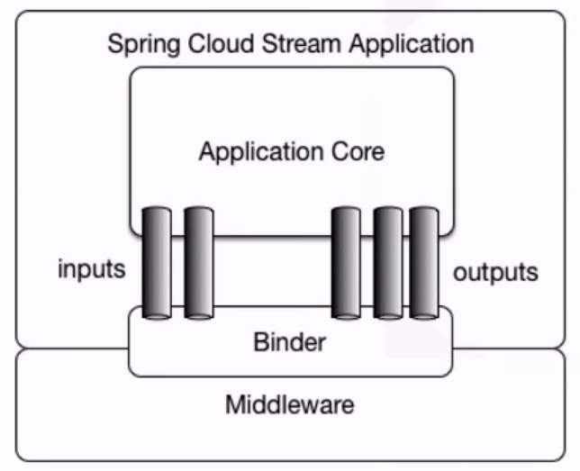

# 简介

Spring Cloud Stream 是一个为微服务构建消息驱动能力的框架。整合了Spring Boot和Spring Integration，实现了一套轻量级的消息驱动的微服务架构。有效的简化了开发人员对消息中间件的使用复杂度，让开发人员有更多的精力去关注于核心业务代码。

## 快速入门

1. 创建Spring Boot 项目，命名stream-demo，pom.xml中添加如下依赖
```xml
    <dependency>
        <groupId>org.springframework.cloud</groupId>
        <artifactId>spring-cloud-stream-binder-kafka</artifactId>
    </dependency>
```

2. 创建自定义通道接口，SendAndReceive
```java
    public interface SendAndReceive{
        
        String SEND1 = "send1";

        String SEND2 = "send2";

        String SEND3 = "send3";

        String INPUT1 = "INPUT1";

        String INPUT2 = "INPUT2";

        String INPUT3 = "INPUT3";

        @Input(SendAndReceive.INPUT1)
        SubscribableChannel input1();

        @Input(SendAndReceive.INPUT2)
        SubscribableChannel input2();

        @Input(SendAndReceive.INPUT3)
        SubscribableChannel input3();

        @Output(SendAndReceive.SEND1)
        MessageChannel send1();

        @Output(SendAndReceive.SEND2)
        MessageChannel send2();

        @Output(SendAndReceive.SEND3)
        MessageChannel send3();
    }
```

3. 创建消息接收发送类
```java
    @EnableBinding(SendAndReceive.class)
    @WebAppConfiguration
    public class ReciverAndSend{

        @Autowired
        private SendAndReceive sendAndReceive;

        @StreamListener(Sink.INPUT1)
        public void revice1(Object payload){
            ...
        }

        @StreamListener(Sink.INPUT2)
        public void revice2(Object payload){
            ...
        }

        @StreamListener(Sink.INPUT3)
        public void revice3(Object payload){
            ...
        }

        public void send1(){
            sendAndReceive.send1().send(MessageBuilder.withPayload("内容").build())
        }

        public void send2(){
            sendAndReceive.send2().send(MessageBuilder.withPayload("内容").build())
        }

         public void send3(){
            sendAndReceive.send2().send(MessageBuilder.withPayload("内容").build())
        }

    }
```

4. 创建服务启动类
```java    
    @SpringBootApplication
    public class Application {

        public static void main(String[] args) {
            SpringApplication.run(Application.class, args);
        }

    }
```

5. 配置文件中添加如下配置
```yml
    spring.cloud.stream.defaultBinder: 配置默认绑定器，比如kafka
    spring.cloud.stream.bindings.input1.group: 为具体通道绑定分组名，通常设置成服务名
    spring.cloud.stream.bindings.input1.destination: 设置具体通道消费主题
    spring.cloud.stream.bindings.output1.destination: 设置具体通道输出消息的主题
    spring.cloud.stream.bindings.input1.content-type: 设置输入通道MIME类型
    spring.cloud.stream.kafka.binder.brokers: 配置kafka地址
    ...
```

## 核心概念

Spring Cloud Stream构建的应用程序与消息中间件之间通过绑定器Binder相关联，绑定器相对于应用程序而言起到了隔离作用，它使得不同消息中间件的实现细节对应用程序是透明的，我们只需要使用Binder提供的抽象概念来使用消息中间件，这个抽象概念就是Channel。



### 绑定器

绑定器通过channel通道完美的实现了应用程序与消息中间件细节之间的隔离解耦，对于更换消息中间件只需要更换对应的Binder绑定器而不用需改任何代码逻辑。

### 发布订阅模式

Spring Cloud Stream中的消息通信方式遵循发布-订阅模式，当一条消息投递到消息中间件后，会通过共享的Topic主题进行广播，消息订阅者接收消息并触发自身逻辑。

### 消息分组

spring.cloud.stream.bindings.input.group可以为应用实例指定分组，如果不显示为应用指定分组，Spring Cloud Stream将为其分配一个独立的匿名消费组。对于同一个Topic下同一分组的应用实例只有一个会消费。

### 消息分区

通过消息分区可以实现当生产者将消息数据发送给多个消费者实例时，保证拥有相同特征的消息数据始终是由同一个消费者实例接收处理，
 