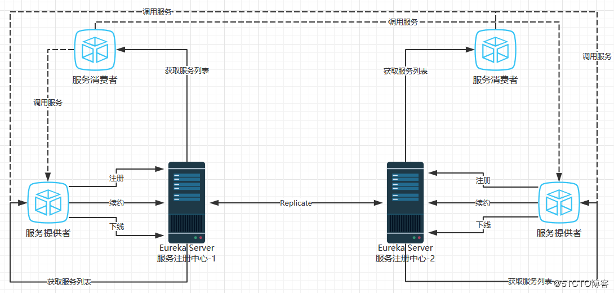

# 服务治理

服务治理组件是微服务架构最核心和基础的模块，主要实现各个微服务实例的自动注册与发现。

## 服务注册

每个微服务向注册中心登记自己提供的服务，将主机、端口、版本号、通信协议等一些附加信息告知注册中心，注册中心按服务名分类组织服务清单。注册中心维护一个心跳去监测清单中服务是否可用，若不可用从服务清单中剔除。

## 服务发现

在服务治理框架下运行，服务间的调用不用指定具体服务实例的地址，而是通过服务名发起请求调用实现。调用方需要向注册中心咨询服务，获取所有服务列表，实现对具体服务的调用。对于同一个服务名多个服务实例，调用方将以某种策略获取出一个位置进行访问。

# Eureka

## Eureka服务端

Eureka服务端即服务注册中心。提供注册中心相关功能，可以集群方式部署

## Eureka客户端

处理服务的注册与发现。客户端服务通过注解和参数配置的方式，嵌入在客户端应用程序代码中，应用程序运行时，Eureka客户端向注册中心注册自身提供的服务并周期性地发送心跳来更新服务租约。同时，也能从服务端查询当前注册的服务信息列表并缓存到本地并周期性地刷新服务状态。

## 搭建服务注册中心

1. 创建基础Spring Boot工程，命名为eureka-server，并在pom.xml中引入必要的依赖
```xml
        <parent>
          <groupId>org.springframework.boot</groupId>
          <artifactId>spring-boot-starter-parent</artifactId>
          <version>1.5.14.RELEASE</version>
          <relativePath/> <!-- lookup parent from repository -->
        </parent>
        <dependencies>
          <dependency>
            <groupId>org.springframework.boot</groupId>
            <artifactId>spring-boot-starter-undertow</artifactId>
          </dependency>
          <dependency>
            <groupId>org.springframework.boot</groupId>
            <artifactId>spring-boot-starter-web</artifactId>
            <exclusions>
              <exclusion>
                <groupId>org.springframework.boot</groupId>
                <artifactId>spring-boot-starter-tomcat</artifactId>
              </exclusion>
             </exclusions>
           </dependency>
           <dependency>
             <groupId>org.springframework.cloud</groupId>
             <artifactId>spring-cloud-starter-eureka-server</artifactId>
           </dependency>
        </dependencies>     
```   

2. @EnableEurekaServer注解启动一个服务注册中心
```java
        @EnableEurekaServer
        @SpringBootApplication
        public class EurekaServerApplication {

                public static void main(String[] args) {

                        SpringApplication.run(EurekaServerApplication.class, args);

                }

        }
```

3. 添加bootstrap.yum文件
```yml
        server:
          port: 8000
        spring:
          application:
            name: eureka-server
```

4. 添加application.yml配置文件
```yml
        eureka:
          instance:
            preferIpAddress: true
            leaseRenewalIntervalInSeconds: 10
            leaseExpirationDurationInSeconds: 30
          client:
            register-with-eureka: false
            fetch-registry: false
            serviceUrl:
              defaultZone: ${EUREKA_DEFAULT_ZONE:http://localhost:8000/eureka/}
            registryFetchIntervalSeconds: 10
            disable-delta: true
          server:
            evictionIntervalTimerInMs: 4000
```

eureka.client.register-with-eureka: 设置是否向注册中心注册服务，因为本身为注册中心不需要注册自己。如果是注册中心集群则不需要此配置，默认为true。

eureka.client.fetch-registry: 设置是否去注册中心检索服务，因为本身为注册中心维护有服务列表不用去检索。如果为注册中心集群则不需此配置，默认为true。

eureka.client.serviceUrl.defaultZone: 注册中心地址

eureka.client.registryFetchIntervalSeconds: 间隔多久去拉取服务注册信息，默认30秒

## 服务提供者

1. 创建一个Spring Boot项目，命名为oauth-server，pom.xml如下
```xml 
        <dependency>
            <groupId>org.springframework.boot</groupId>
            <artifactId>spring-boot-starter-undertow</artifactId>
        </dependency>
        <dependency>
            <groupId>org.springframework.boot</groupId>
            <artifactId>spring-boot-starter-web</artifactId>
            <exclusions>
                <exclusion>
                    <groupId>org.springframework.boot</groupId>
                    <artifactId>spring-boot-starter-tomcat</artifactId>
                </exclusion>
            </exclusions>
        </dependency>
        <dependency>
            <groupId>org.springframework.boot</groupId>
            <artifactId>spring-boot-starter-test</artifactId>
            <scope>test</scope>
        </dependency>
        <dependency>
            <groupId>org.springframework.cloud</groupId>
            <artifactId>spring-cloud-starter-netflix-eureka-client</artifactId>
        </dependency>
```

2. 添加@EnableDiscoveryClent注解，开启服务发现功能
```java        
        @EnableEurekaClient
        @SpringBootApplication
        public class OauthServerApplication {

                public static void main(String[] args) {

                        SpringApplication.run(OauthServerApplication.class, args);

                }
        }
```

3. 添加bootstrap.yml配置文件
```xml
        server:
          port: 8020
        spring:
          application:
            name: oauth-server
```

4. 添加applocation.yml文件
```yml
        eureka:
          client:
            serviceUrl:
              defaultZone: ${EUREKA_DEFAULT_ZONE:http://localhost:8000/eureka/}
            registryFetchIntervalSeconds: 10
```

# 服务治理机制



## 服务提供者

### 服务注册

服务启动时服务通过reset请求将自己注册到Eureka，同时带上服务的一些元数据信息。Eureka接收到reset请求后，将元数据信息存储在一个双层结构Map中，第一层的key是服务名，第二层的key是服务实例名。

### 服务同步

上图中两个服务提供者分别注册到两个注册中心，由于注册中心之间的相互注册，当服务提供者发送注册请求到一个注册中心时，它会将该请求转发到相连的其它注册中心，从而实现注册中心之间的服务同步。我们可以从任意一个注册中心获取所有的注册服务信息。

### 服务续约

服务注册完成之后，服务提供者将维护一个心跳来告诉注册中心服务还活着，防止注册中心将实例从服务列表中剔除。eureka.instance.lease-renewal-interval-in-second参数用于定义服务续约任务的调用间隔时间，默认30秒。eureka.instanc.lease-expiration-duration-in-seconds参数用于定义服务失效时间，默认90秒。

## 服务消费者

### 获取服务
服务消费者启动时，将发送REST请求从服务注册中心获取注册的服务信息列表。为了性能考虑，Eureka会维护一份只度的服务清单来返回给客户端，同时该缓存清单会每隔30秒更新一次。eureka.client.registry-fetch-interval-seconds设置更新缓存服务清单时间。

### 服务调用

服务消费者在获取到服务信息列表后，通过服务名可以获取服务对应的实例名和元数据信息。消费者可以自己选择需要具体调用那个实例，在Ribbon中会默认采用轮询方式进行调用，从而实现客户端的负载均衡。

### 服务下线

系统运行过程中服务停止或重启，服务将发起一个REST请求给注册中心，注册中心将实例状态设置为下线，并且将这个时间传播出去

## 服务注册中心

### 失效剔除

当服务超过设置的服务失效剔除时间，注册中心将中服务列表中剔除服务实例信息。

### 自我保护

当服务心跳失败比例小于85%时，注册中心将启动自我保护机制，注册中心将不会剔除失效服务。


        

