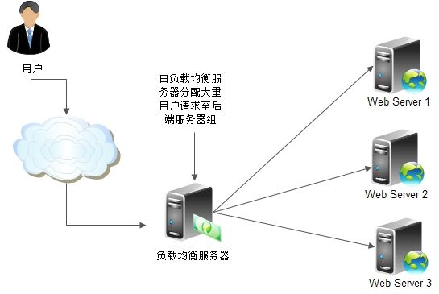

# Ribbon 简介

Spring Cloud Ribbon是基于HTTP和TCP的客户端负载均衡工具。其使用是内嵌到微服务中，提供微服务之间的调用，并支持客户端负载均衡。 

## 客户端负载均衡

通常说的负载均衡指服务端负载均衡，服务端负载均衡可分为软件负载均衡和硬件负载均衡。但无论是软件负载均衡还是硬件负载均衡都会在服务端维护一个服务列表，当用户调用服务资源时服务端将根据服务列表决定调用那个服务实例。
客户端负载均衡不同于服务端负载均衡，客户端负载均衡服务列表维护在客户端，客户端通过心跳维护服务端服务列表。客户端会每隔一段时间更新本地服务列表，Ribbon做为客户端负载均衡框架，可以负载均衡的方式调用服务实例，默认采用轮询的方式
- 服务提供者启动多个服务实例
- 服务调用方通过使用@LoadBalanced注解修饰过的RestTemplate来实现向服务接口调用

## 常用配置属性
ribbon.key=value全局通用设置模式
 - ribbon.ReadTimeout: 客户端读取超时时间，超时时间要小于Hystrix的超时时间，否则重试机制就无意义了
 - ribbon.ConnectTimeout: 客户端连接超时时间
 - ribbon.OkToRetryOnAllOperations: 访问实例失败(超时)，允许自动重试
 - ribbon.MaxAutoRetries: 设置重试次数，失败后会更换实例访问，请一定确保接口的幂等性，否则重试可能导致数据异常
 - ribbon.MaxAutoRetriesNextServer: 切换服务器实例的重试次数

<client>.ribbon.key=value针对不同客户端设置模式
 - <client>.ribbon.ReadTimeout: 客户端读取超时时间，超时时间要小于Hystrix的超时时间，否则重试机制就无意义了
 - <client>.ribbon.ConnectTimeout: 客户端连接超时时间
 - <client>.ribbon.OkToRetryOnAllOperations: 访问实例失败(超时)，允许自动重试
 - <client>.ribbon.MaxAutoRetries: 设置重试次数，失败后会更换实例访问，请一定确保接口的幂等性，否则重试可能导致数据异常
 - <client>.ribbon.MaxAutoRetriesNextServer: 切换服务器实例的重试次数
