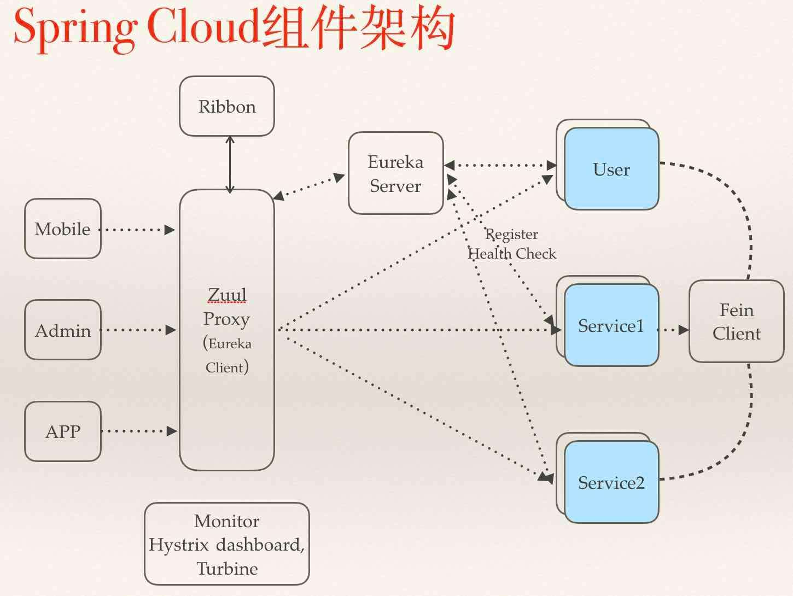

# 简介

API网关作为微服务系统提供对外资源的入口，起到了对服务资源进行统一管理的作用。除了要实现请求路由、负载均衡、校验过滤等功能外，还需要与服务治理框架结合、请求转发时的熔断机制、服务聚合等。Spring cloud Zuul是spring微服务架构提供的API网关解决方案，它通过与Eureka注册中心整合，可以方便的获取到系统中的服务信息。Zuul作为微服务系统的入口可以方便的管理服务资源，对请求进行统一的管理，可以添加拦截校验等逻辑。

## 快速入门



1. 创建一个Spring Boot工程，命名为api-gateway，并在pom.xml中添加如下依赖
```xml
    <dependency>
        <groupId>org.springframework.cloud</groupId>
        <artifactId>spring-cloud-starter-zuul</artifactId>
    </dependency>
    <dependency>
        <groupId>org.springframework.cloud</groupId>
        <artifactId>spring-cloud-starter-eureka</artifactId>
    </dependency>
```
spring-cloud-starter-zuul除包含zuul-core外还包括:
    spring-cloud-starter-hystrix: 该依赖主要实现对网关服务转发的保护机制，通过线程隔离和断路器，防止微服务故障引发API网关资源无法释放。

    spring-cloud-starter-ribbon: 网关服务在进行路由转发时实现负载均衡

    spring-cloud-starter-actuator: 提供微服务管理端点。Zuul还提供了/routes端点返回当前所有路由规则

2. 创建主类
```java
    @EnableZuulProxy
    @SpringBootApplication
    public class GatewayApplication {

        public static void main(String[] args) {
            SpringApplication.run(GatewayApplication.class, args);
        }

    }
```

## 常用配置

### 请求路由

 - zuul.routes.<自定义路由名>.path: 设置请求匹配路由

 - zuul.routes.<自定义路由名>.serviceId: 设置匹配路由将会发送到的微服务

 - zuul.routes.<自定义路由名>.url: 设置匹配路由将会发送到的url

 - zuul.ignored-services: 设置匹配表达式的Service Zuul将不会建立默认路由规则

 - zuul.ignored-patterns: 设置忽略匹配路径

 - zuul.retryable: 设置全局是否关闭请求重试

 - zuul.routes.<route>.retryable: 设置指定路由是否关闭请求重试

### 请求过滤

1. 添加zuul过滤器类。继承ZuulFiter
```java
    /**
    * 添加token和label到请求header
    *
    * @author flyleft
    */
    public class HeaderWrapperFilter extends ZuulFilter {

        private static final Logger LOGGER = LoggerFactory.getLogger(HeaderWrapperFilter.class);

        private GatewayProperties gatewayHelperProperties;

        public HeaderWrapperFilter(GatewayProperties gatewayHelperProperties) {
            this.gatewayHelperProperties = gatewayHelperProperties;
        }

        private static final int HEADER_WRAPPER_FILTER = -1;

        /**
         * 过滤器类型，决定过滤器在那个生命周期中执行。pre表示在被路由之前执行，route表示在路由请求时被调用，post表示在route和error过滤器之后被调用，error表示处理请求发生错误时被调用
         */
        @Override
        public String filterType() {
            return "pre";
        }

        /**
         *过滤器执行顺序，值越小优先级越高
         */
        @Override
        public int filterOrder() {
            return 0;
        }

        /**
         *过滤器是否需要被执行
         */
        @Override
        public boolean shouldFilter() {
            return true;
        }

        /**
         *过滤器的具体逻辑
         */
        @Override
        public Object run() {
            RequestContext ctx = RequestContext.getCurrentContext();
            HttpServletRequest request = ctx.getRequest();
            String token = (String) request.getAttribute(HEADER_JWT);
            if (StringUtils.isEmpty(token)) {
                LOGGER.info("Request get empty jwt , request uri: {} method: {}", request.getRequestURI(), request.getMethod());
            } else {
                ctx.addZuulRequestHeader(HEADER_TOKEN, token);
                if (gatewayHelperProperties.isEnabledJwtLog()) {
                    LOGGER.info("Request get jwt , request uri: {} method: {} JWT: {}",
                            request.getRequestURI(), request.getMethod(), token);
                }
            }
            return null;
        }
```

2. 将过滤器添加到IOC容器中，创建配置类

```java
    /**
    * 自定义configuration配置类
    *
    * @author flyleft
    */
    @Configuration
    @EnableConfigurationProperties(GatewayProperties.class)
    public class CustomZuulConfig {

        @Bean
        public HeaderWrapperFilter headerWrapperFilter(GatewayProperties gatewayHelperProperties) {
            return new HeaderWrapperFilter(gatewayHelperProperties);
        }
            
    }
```

### 路径匹配

路径匹配当匹配到一个满足路径表达式时匹配结束。因此需要保证配置文件读取到有序，需要使用YAML配置文件

 - ?: 表示匹配任意单个字符

 - *: 表示匹配任意数量的字符

 - **: 表示匹配任意数量的字符，支持多级目录

### 路由前缀

 - zuul.prefix: 为全局的路由规则设置前缀信息

 - zuul.stripPrefix: 关闭移除代理前缀的动作

 - zuul.routes.<route>.strip-prefix: 关闭指定路由移除代理前缀动作

### Cookie与头信息
    
 - zuul.sensitiveHeaders: 设置Zuul的敏感头信息，默认包括Cookie、Set-Cookie、Authorization。设置为敏感头信息的内容将在路由时被网关过滤。
 
 - zuul.routes.<router>.customSensitiveHeaders: 设置指定路由开启自定义敏感头，将去除默认敏感头设置
 
 - zuul.routes.<router>.sensitiveHeaders: 设置指定路由的敏感头

### 重定向问题

系统内部重定向跳转，Location指向具体服务实例地址，导致请求没有通过网关控制

 - zuul.addHostHeader: 设置请求转发前设置Host头信息，标识最初的服务端请求地址,默认false，设置为true将表示最初服务端请求地址


