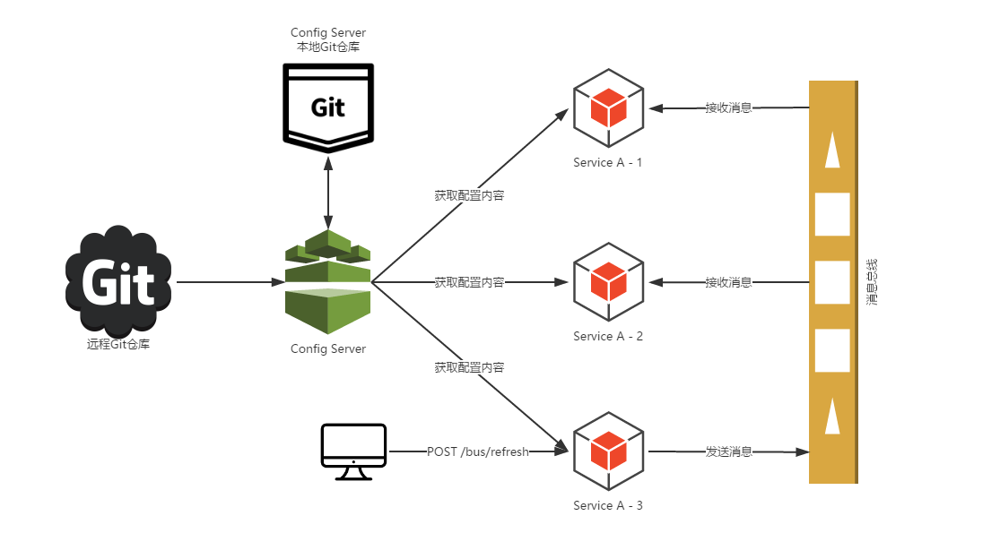

# 简介

Spring Cloud Config用来为分布式系统中基础设施和微服务应用提供集中化的外部配置支持，分为服务端和客户端两部分。服务端作为独立的微服务，用来链接配置仓库并为客户端提供获取配置信息、加密/解密信息等访问接口；客户端内嵌在微服务中，当微服务启动时将从配置的配置中心获取和加载配置信息。



## 快速入门

1. 创建一个Spring Boot工程，命名为config-server，并在pom.xml中添加如下依赖
```xml
    <dependency>
        <groupId>org.springframework.cloud</groupId>
        <artifactId>spring-cloud-config-service</artifactId>
    </dependency>
    <dependency>
        <groupId>org.springframework.cloud</groupId>
        <artifactId>spring-cloud-starter-eureka</artifactId>
    </dependency>
```

2. 创建主类,添加@EnableConfigServer开启Spring Cloud Config的服务端功能
```java
    @EnableConfigServer
    @EnableDiscoveryClent
    @SpringBootApplication
    public class ConfigServerApplication {

        public static void main(String[] args) {
            SpringApplication.run(ConfigServerApplication.class, args);
        }

    }
```

3. 配置文件中添加Git仓库的相关信息
```yml
    spring.cloud.config.server.git.uri: 配置Git仓库位置
    spring.cloud.config.server.git.searchPaths: 配置路径下的相对搜索位置，可以配置多个
    spring.cloud.config.server.git.usernane: 配置访问Git仓库的用户信息
    spring.cloud.config.server.git.password: 配置访问Git仓库的用户名秘密
    spring.cloud.config.server.git.basedir: 设置配置中心缓存拉取配置文件的目录
```

4. 创建配置仓库

根据config-server中配置的Git仓库位置创建仓库，并根据不同环境新建对应的配置文件

    configspace.properties
    configspace-dev.properties
    configspace-test.properties
    configsapce-prod.properties

访问配置信息的URL与配置文件的映射关系，application对应应用名，profile对应环境名，label对应Git上不同分支

    /{application}/{profile}[/{label}]
    /{application}/{profile}.yml
    /{label}/{application}-{profile}.yml
    /{application}/{profile}.properties
    /{label}/{application}-{profile}.properties


微服务应用从配置中心获取配置文件时，配置中心将通过git clone加载配置文件到配置中心本地，并将这些配置文件返回给微服务应用。即使配置中心不能访问Git配置文件地址时也能返回配置文件
 
## 客户端配置

1. 创建一个Spring Boot应用，命名为config-client，并在pom.xml中添加如下依赖
```xml
    <dependency>
        <groupId>org.springframework.cloud</groupId>
        <artifactId>spring-cloud-starter-config</artifactId>
    </dependency>
    <dependency>
        <groupId>org.springframework.cloud</groupId>
        <artifactId>spring-cloud-starter-eureka</artifactId>
    </dependency>

    <!-- 配置访问配置中心失败时重试依赖 -->
    <dependency>
        <groupId>org.springframework.retry</groupId>
        <artifactId>spring-retry</artifactId>
    </dependency>
    <dependency>
        <groupId>org.springframework.boot</groupId>
        <artifactId>spring-boot-starter-aop</artifactId>
    </dependency>
```

2. 创建Spring Boot主类
```java
    @EnableDiscoveryClent
    @SpringBootApplication
    public class Application {

        public static void main(String[] args) {
            SpringApplication.run(Application.class, args);
        }

    }
```

3. 配置文件bootstrap.properties中添加如下配置项
```yml
    spring.application.name: 配置获取配置文件的服务名
    spring.cloud.config.profile: 配置获取配置文件的环境名
    spring.cloud.config.label: 配置获取配置文件的版本
    spring.cloud.config.url: 配置中心的地址

    spring.cloud.config.discovery.enable: 设置是否开启服务名访问配置中心功能
    spring.cloud.config.discovery.serviceId: 设置要访问配置中心服务名

    spring.cloud.config.failFast: 设置客户端启动时是否优先尝试判断从配置中心获取配置信息是否正常
    spring.cloud.config.retry.multiplier: 设置初始重试间隔时间
    spring.cloud.config.retry.initial-interval: 设置下一间隔的乘数
    spring.cloud.config.retry.max-interval: 设置最大间隔时间，默认为2000毫秒
    spring.cloud.config.retry.max-attempts: 设置最大重试次数，默认为6次  
```