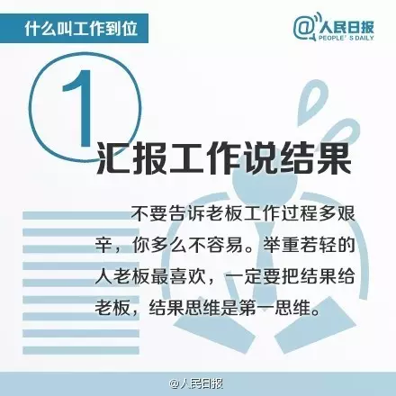
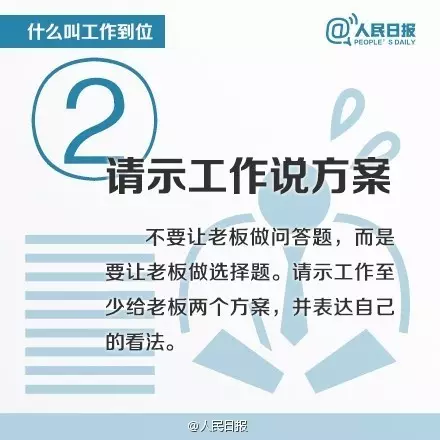
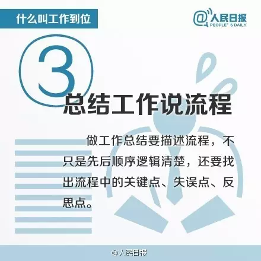
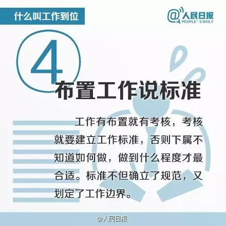
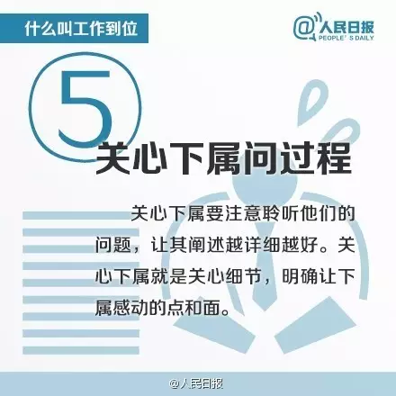
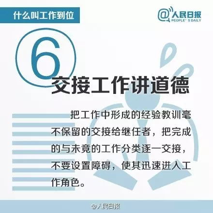
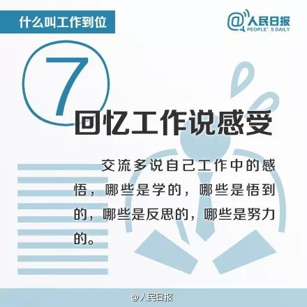

## 一、汇报工作说结果

不要告诉老板工作过程多艰辛，你多么不容易。举重若轻的人老板最喜欢，一定要把结果给老板，结果思维是第一思维。

## 二、请示工作说方案

不要让老板做问答题，而是要让老板做选择题。请示工作至少给老板两个方案，并表达自己的看法。

## 三、总结工作说流程

做工作总结要描述流程，不只是先后顺序逻辑清楚，还要找出流程中的关键点、失误点、反思点。

## 四、布置工作说标准

工作有布置就有考核，考核就要建立工作标准，否则下属不知道如何做，做到什么程度才最合适。标准不但确立了规范，又划定了工作边界。

## 五、关心下属问过程

关心下属要注意聆听他们的问题，让其阐述越详细越好。关心下属就是关心细节，明确让下属感动的点和面。

## 六、交接工作讲道德

把工作中形成的经验教训毫不保留的交给继任者，把完成时与未竟的工作分类逐一交接，不要设置障碍，使其迅速进入工作角色。

## 七、回忆工作说感受

交流多说自己工作中的感悟，哪些是学的，哪些是悟到的，哪些是反思的，哪些是努力的。

