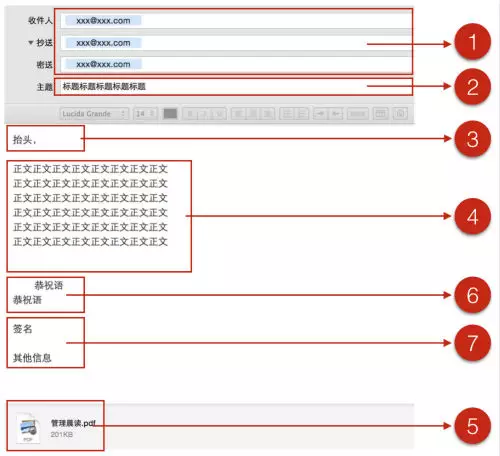

# 邮件须知

## 先看两个故事：
- 故事1 与人方便，自己方便

```
有两个能力相同，成绩都很好，经历也都差不多的学生，一位叫田宜龙，一位叫王裕源。
有位知名教授今年只招收一名博士生，田宜龙和王裕源都想争取这个名额，于是他们分头写了差不多的简历，寄给教授。
不太一样的是，田宜龙把简历写好，装进信封、写好地址、贴上邮票就寄出去了。而王裕源同学则多了一个心眼，他在装简历的信封里，放了一个写着自己名字、地址、邮编并贴好邮票的空信封。
结果大家可能都猜得到——王裕源被录取了。

大家是不是觉得王裕源同学好贼啊？
```

- 故事2 和他一起做事很舒服

```
在上家公司有一位同事张志勇，三年多时间，从一名普通的java开发工程师做到了子公司的副总裁。
由于工作的性质，经常能接触到公司几位老总，有一次听到他们对张志勇的评价：跟他一起做事情总感觉很舒服，其他工作能力且不说，仅在发邮件这一件事情上，在有重要邮件时，他一定会很快回复：收到了，然后简单说明会怎样的安排；在执行过程中又会定期邮件反馈事情的进展。

腹黑地说，张志勇真狡猾，在邮件这个很容易闪光的点上，他做的非常出彩。
```

> 当我们盯着别人看——“为什么是他”的时候，最好多想一想——“为什么不是我？”

当我们觉得王裕源同学很贼，张志勇很狡猾的时候，我们不妨想一想他们思考的出发点是什么？

```
多为他人着想把事情做在前面
做人按这个思想去做，朋友多
做事按这个思想去做，效率高
邮件按这个思想去写，升值快
上面这个字是“值”哦
```

这是比技巧更高层面的东西——`思想，换位思考，提前做准备`。写邮件虽然是一件小事，但是用这个思想去写，能给你带来很多好处、避免很多麻烦。


下面我们就逐点详解：如何写好工作邮件。

## 工作邮件的用途

工作邮件用途：`简单而且重要的事项沟通`

日常工作中的沟通有三种形式：面谈（会议），电话，邮件，并不是所有的事情都适合用邮件来沟通。

复杂的事情不要通过邮件讨论，这要效率很低；有争议的事情不要在邮件中讨论，容易引起不必要的误会。

- 简单而重要的事情马上发邮件，提高你在领导面前的曝光率；
- 重要事情的安排、结论，一定要发邮件，备忘、备查、提醒参与者；
- 复杂的事情，先开会，再邮件发会议记录；
- 不重要的事情，不要发邮件，不要让领导觉得你总是抓不住重点。

## 工作邮件分类

工作邮件大致可分为以下四类：`1、确认邮件；2、需求邮件；3、反馈邮件；4、通知邮件`。

1、确认邮件——存证据

口头、电话、会议交流的事情，邮件进行确认 这是一个好习惯，很多人不是很注意。

```
比如刘杨，是一枚互联网产品经理，有一天他不巧在厕所遇到领导。
领导说：我觉得上厕所的时候测一下尿的流速，这是个很好的产品点子哦，刘杨你去做个 APP 吧！
刘杨心想，你他妈有病吧，但口头上还是夸领导：领导真是高啊！这个点子真棒！
刘杨当这是个笑话就没管这个事，结果领导非常气愤，把他叫到办公室里蹂躏了一番……
如果刘杨回到座位，马上写了一封确认邮件：领导，跟您确认一下，是不是真的要做测尿尿流速的 APP ？
领导回复：其实是开玩笑的啦，别当真。
这下皆大欢喜，不用做无用功了。但是，请注意但是，领导对刘杨的印象会好很多：这个孩子做事很靠谱！
```

2、需求邮件——有细节

部门内部、跨部门、跨公司，我们经常会给别人提出工作的需求，这个大家接触的都比较多了。

需要强调的是：要把细节写清楚、量化出来，这样需求才精确，接需求的人知道怎么做，结果也不会太让你难受。

```
比如，领导真的抽风让刘杨做测尿流速的 APP ……
刘杨做好了产品原型，让UI设计师做一张产品的的背景图，没有明确尺寸、风格等细节。三天后发过来一个莫名其妙的东西，导致工期延误，刘杨就等死吧。
```


3、反馈邮件——有反应

这个是跟第2种，“需求邮件”对应的，收到别人的需求邮件后，应该尽快反馈。注意，反馈邮件最好是发两封：

第一封：确认收到需求，并告知对方自己的计划安排

第二封：反馈结果输出物，并对输出物做适当的说明

```
比如刘杨的领导觉得尿尿流速 APP 非常值得做，于是发需求邮件给刘杨。
刘杨接到后，马上写邮件给领导，以及研发、运营、UI设计等相关人员：

1、本周五开会讨论该项目的可行性
2、下周一编写产品需求文档
3、………………

结果周五开会一讨论，领导突然觉得自己很傻逼，这个事情就不用做了。
```

4、通知邮件——广播站

通知类型的邮件

```
比如：《元旦放假通知》
比如：《关于刘杨晋升为公司副总的通知》
```

这种邮件不需要回复，也最好不要回复。

因为通知邮件往往都是群发N多人的，你一回复就很可能造成大家在邮件里群聊，非常影响别人的工作。


## 工作邮件的结构



从邮件的结构看，有：`1、发送地址；2、标题；3、抬头；4、正文；5、附件；6、恭祝语；7、签名档`。


下面介绍每部分需要注意的要点：

1、发送地址

发送地址区，有收件人、抄送人、密送人三个部分。

a）收件人

收件人需要处理该邮件的人，或者是通知发布的对象。

在这里`注意不要一事二报，也就是一件事情不要同时申请两个领导批示；一件事情不要安排给两个人去做`。

这个也牵扯到做事情的方法上了：

```
比如你明天想要请一天假，同时发给部门经理和总经理，请求批准。
部门经理一看，我操，大领导在呢，我批不批啊，还是让大领导先发话吧，这厮是想在老总面前让我好看么？
总经理一看，妈的，这种事情也要我批，想累死老子啊？
结果谁都不鸟你，你这假算请了还是没请呢？
```


b）抄送人

放在抄送人里，只是让对方知会一下，他可以不回复。

```
比如请假的例子，就应该主送自己的部门经理，抄送总经理。
这样部门经理好处理，总经理还会感觉你是很规矩的人，动向都让他知道。
```


另如果是跨部门，需要两个领导都确认的邮件，最好只请示自己的领导，跨部门的沟通让领导去协调。

尽量不要做跨越自己部门范围请示的事情，因为你的命运主要把握在直接领导手里，别让他觉得你很难搞。

c）密送人

密送人其实很有用

不方便让别人看到在收件人列表里出现的人，可以放在密送里；

重要的、容易忘的邮件，密送给自己一份，可以方便管理查看；

在发送通知类邮件时，不想让大家在邮件里群体回复，可以把发送对象的邮件地址列表放在密送人里。这样大家看到的收件人里只有自己，全部回复也不会打扰到其他人。

2、标题

标题是整个邮件的金字塔顶端，避免使用口语化的文字，会显得很不职业

多次或者转发的邮件，标题上会被加上很多的 re：fw：re：re：re：re：

而且这种邮件
```
1、最好不要参与进去
2、非要参与的话，把标题清理清理
```

为什么不要参与，因为了这么多次的邮件肯定是已经靠邮件无法解决的问题了，不如开会讨论一下，节约大家的时间，不管是当面或电话会议都好。

电话或会议之后不要忘了发一封讨论结果确认邮件。


另如果需要每天发一次的邮件，比如日报、例行数据发送等，建议标题这么写： 12 月 28 日 关于 xxx 的 xxx

用当日的日期开头，方便以后检索。

3、抬头

抬头也就是称呼，这里最好是按照公司文化写，有的公司文化领导就喜欢直呼名字，有的公司文化必须称呼 x 总，xx 总。

我一般是这么处理： 单独写给领导的邮件直呼姓名或昵称；有第三人的时候称呼 x 总。单独写邮件，称呼 x 总，感觉对领导不够信任、不够亲切；有其他人的时候，不称呼 x 总，显得对领导不够尊重。

尤其是在创业团队里，大家没什么级别概念，内部发邮件都称呼名字。但是在对外部公司写邮件的时候，一定要把级别表明出来，这样对合作有好处。

否则外部公司的人可能会想：这特么什么破公司啊，找了一帮没级别的人跟我来谈合作，能靠谱吗？

4、正文

正文，首先要注意遵循金字塔原理，先说中心思想，再详细阐述细节。

一行内容不要超过 15 个字，字体不要太小，不要太大，不要颜色怪异。

一行字太多，有的人邮件查看是竖着的三栏，他看到的就是有很多行的文字，很可能就不仔细看了。

建议用字号用小四（20号），字体用宋体，颜色用黑色，强调的关键词用红色，但红色不要用太多。

p.s. 别人的名字不要用红色。

多条内容，一定要用编号排列一下，显得你非常有条理，别人读的时候效率也高。

总之，要把邮件当成是网页去设计，根据读者的体验去考虑文案和排版。

另一封邮件说的事情不要太多，还是刚才说的道理，事情多了，就需要开会了。

5、附件

附件少的时候最好不要打包，这个跟产品设计非常类似，能在一级页面看的东西，用户一般不愿意到二级页面去看。

附件不要太大，这个很好理解，有的公司网速很慢，你发大附件肯定有人会想要掐死你。

附件多，必须打包的时候，一定要在邮件正文里做一下附件说明：附件中是 xx，请查收

因附件较多，必须要打成压缩包发送的话，一定要在邮件正文里做一下附件说明，比如这样：

压缩包中包括：
```
1、xxxx 文档，是对 xxx 的说明
2、xxxx 文档，是对 xxx 的说明
3、xxxx 文档，是对 xxx 的说明
```

讲一下每个附件是干什么的，方便收到邮件的人查看。

6、恭祝语

7、签名及其他信息

恭祝语、签名及其他信息，这些都好理解，按公司的要求来就好，不多说了。

如果贵公司没有这方面的规范，你可以你一封邮件提个建议，恭喜你，又升值了哦。


## 撰写顺序

估计大多数人都是先写收件人，然后写标题，然后写正文，然后pia~发送了。

这个流程在你很忙乱的时候很可能会出错，我们最好用一个容错率高的流程，像这样：

`标题——>正文——>附件——>收件人`

先写标题，这是整个邮件金字塔的塔尖，先写出来，不跑题 。同时也防止标题遗漏，没有标题的邮件让人非常不爽，显得你非常不职业。

先不要写收件人地址，即使按错了钮，或者按错了快捷键，也不会发出去。

从流程上确保不犯错误，这就是咱普通青年的牛逼之处。

## 一些注意事项

1、2分钟法则

邮箱自动收邮件的时间间隔设置成 2 分钟；

简单紧急又重要的事情最好 2 分钟内马上，不要遗忘；

邮件写好后，不要急着发，花2分钟检查一下各个细节。

2、2步法处理

第1步，定时查收邮件。

重要紧急的，2分钟处理；

重要不紧急的，马上给予回应，约定处理时间；

其他事项标记待处理标签。

第2步，在空闲时间，集中处理待处理邮件。

3、禁忌

喝酒、吵架之后，情绪不稳定的时候，千万不要发邮件；

不要在邮件里争吵和嘲讽，谁做了谁是傻逼；

邮件中有公司机密时，一定要仔细查看收件人，不要有不能收该信息的人。

晨老师就曾经在酒后发过一封骂领导的邮件，后来，我涨工资了…………骗你们的啦，后来我换部门了，这事儿做的非常不职业哦。

4、标点符号

“！”“？”这两个标点符号在邮件里要慎用，下面这个例子，红字是读者的感受，大家可以体会一下。

请问昨天说的邮件发了吗

读者感受——正常询问，疑问句，即使没有问号，也能看出来是在提问，情绪很平静。


请问昨天说的邮件发了吗？

读者感受——结合上下文语境，似乎有点反问的意思了哦。


请问昨天说的邮件发了吗？？

读者感受——你急个毛啊！


请问昨天说的邮件发了吗！

读者感受——你是想说“老子耐心有限”吗？老子时间还有限呢！


请问昨天说的邮件发了吗？！

读者感受——你是想说“你他妈发还是不发”吗？老子还就不发了！


请问昨天说的邮件发了吗？？？？？？？！！！！！！！！！

读者感受——这个二逼！！！！！！


一个问号还好；

两个问号，就显得非常着急，阅读者感受已经开始抵触了；

叹号，让人感觉你在质疑，你在不耐烦，对方更加反感；

问号+叹号 有骂人的感觉了；

一串问号+一串叹号，简直就是个没素质的流氓。


> 整理[管理晨读](https://mp.weixin.qq.com/s/B1FOaXpXHEa7HRq7cfh8-Q)文章而来。