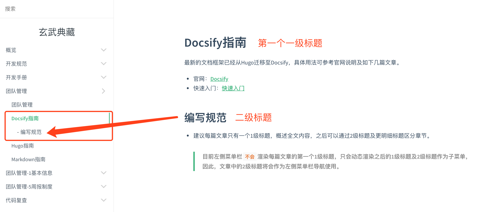

# Docsify指南

## 概述
最新的文档框架已经从Hugo迁移至Docsify，具体用法可参考官网说明及如下几篇文章。

- 官网：[Docsify](https://docsify.js.org/#/?id=docsify)
- 快速入门：[快速入门](https://segmentfault.com/a/1190000017576714)

## 编写规范
- 建议每篇文章`只有一个一级标题`，概述全文内容，`之后全部通过二级标题及更明细标题区分章节`。
> 目前左侧菜单栏`不会`渲染每篇文章的第一个一级标题，只会动态渲染之后的一级标题及二级标题作为子菜单，因此，文章中的二级标题将会作为左侧菜单栏导航使用。

例如：


- 图片建议放到离当前文档最近的目录下的img子目录下，便于引用。

例如：
```
- 80-team
    - img
        - toc-demo.png
    - Docsify指南.md // 引用./img/toc-demo.png
```

- 文档平台内链接引用

例如：
```
具体参见[基本信息](zh-cn/81-basic/基本信息)
```

## 目录规范
侧边栏目录需要手动编辑`docs/_sidebar.md`文件，类似如下：
- 目录/子目录：配置的路由只能指向文件夹或子文件夹，而不能指向具体的Markdown文件，否则链接跳转有问题，例如：`- [概览](zh-cn/10-overview)`
- 叶子菜单：配置的路由只能指向具体的Markdown文件，例如：`- [团队介绍](zh-cn/10-overview/团队介绍)`

```
- [概览](zh-cn/10-overview)
    - [团队介绍](zh-cn/10-overview/团队介绍)
    - [贡献指南](zh-cn/10-overview/贡献指南)
- [开发规范](zh-cn/20-spec)
    - [基础开发规范](zh-cn/20-spec/1-basic)
        - [分支管理](zh-cn/20-spec/1-basic/分支管理)
        - [版本管理](zh-cn/20-spec/1-basic/版本管理)
        - [命名规范](zh-cn/20-spec/1-basic/命名规范)
    - [前端开发规范](zh-cn/20-spec/2-front)
        - [开发环境搭建](zh-cn/20-spec/2-front)
            - [MAC](zh-cn/20-spec/2-front/开发环境搭建-MAC)
            - [Windows](zh-cn/20-spec/2-front/开发环境搭建-Windows)
        - [开发规范](zh-cn/20-spec/2-front)
            - [UED](zh-cn/20-spec/2-front/开发规范-UED)
            - [NPM](zh-cn/20-spec/2-front/开发规范-NPM)
            - [CONST](zh-cn/20-spec/2-front/开发规范-CONST)
            - [ASYNC](zh-cn/20-spec/2-front/开发规范-ASYNC)
    - [后端开发规范](zh-cn/20-spec/3-back)
        - [API规范](zh-cn/20-spec/3-back/API规范)
```

## 侧边栏目录插件
原生组件无法手动折叠、展开侧边栏目录，无法定制化初始展开层次。增加插件如下：
- 增加`index.css`

```css
.sidebar-nav-parent-li {
    position: relative;
  }

  .sidebar-nav {
    padding-right: 10px;
  }

  .sidebar-nav .ul-after {
    content: '';
    width: 10px;
    height: 30px;
    /* background: red; */
    position: absolute;
    right: 10px;
    top: 0px;
    display: flex;
    align-items: center;
  }

  .ul-after-sanjiao {
    width: 0;
    height: 0;
    border-left: 8px solid #cecece;
    border-top: 8px solid transparent;
    border-bottom: 8px solid transparent;
    transition: transform 0.3s;
    position: relative;

  }

  .ul-after-sanjiao::after {
    content: '';
    width: 0;
    height: 0;
    position: absolute;
    top: -8px;
    left: -11px;
    border-left: 8px solid #fff;
    border-top: 8px solid transparent;
    border-bottom: 8px solid transparent;
  }

  .ul-after-sanjiao:hover {
    border-left: 8px solid #42b983;
  }

  .sidebar-nav-parent-li-shouqi .ul-after-sanjiao {
    transform: rotate(90deg);
    transition: transform 0.3s;
  }
```

- `index.html`中`客户化插件`及`依赖jQuery`

```js
<script>
    window.$docsify = {
      plugins: [
        // 控制侧边栏菜单默认展开层级，以及手动收起及展开菜单插件
        function (hook) {
          hook.doneEach(function () {

            let max_cengji = 1; //默认展开层级深度
            // 存在子节点则添加箭头
            $('.sidebar-nav').find('li>a').each(function (i, e) {
              var el = e;
              // 需要排除自动生成的章节标题类菜单
              if (el.nextSibling && el.nextSibling.tagName == 'UL' && !$(el.nextSibling).hasClass('app-sub-sidebar')) {
                $(el).addClass('sidebar-nav-parent-li').append(
                  "<div class='ul-after'><div class='ul-after-sanjiao'></div></div>");
              }
            })

            // 初始时候展开层级
            function findChildrenLi(dom, current_cengji) {
              if (dom) {
                current_cengji++;
                $($(dom).find('li>a').each(function (i, e) {
                  var el = e;
                  if (el.nextSibling && el.nextSibling.tagName == 'UL' && !$(el.nextSibling).hasClass('app-sub-sidebar')) {
                    // 需要考虑：点击文章时，组件自动展开文章的标题作为子菜单，此时将会重新刷新菜单，但是会保留active状态，因此，需要排除这种菜单的误操作，否则将会自动收起所有
                    if (current_cengji >= max_cengji && $(el.nextSibling).find('li.active').length < 1) {
                      $(el.nextSibling).hide();
                      $(el).addClass('sidebar-nav-parent-li-shouqi');
                    }
                    findChildrenLi(el.nextSibling, current_cengji);
                  }
                }))
              } else {
                return
              }
            }

            findChildrenLi($('.sidebar-nav')[0], 0);

            // 绑定点击事件
            $('.sidebar-nav-parent-li').on('click', function (e) {
              e.stopPropagation();
              e.preventDefault();
              var el = e.target.nextSibling;
              if (el) {
                $(el).toggle();
                if ($(e.target).hasClass('sidebar-nav-parent-li-shouqi')) {
                  $(e.target).removeClass('sidebar-nav-parent-li-shouqi');
                } else {
                  $(e.target).addClass('sidebar-nav-parent-li-shouqi');
                }
              }
            });
            // end of bind
          });
          // end of hook function invoke
        }, // end of hook
      ],
      // plugins结束
    }
  </script>

  <script src="https://cdnjs.cloudflare.com/ajax/libs/jquery/3.3.1/jquery.min.js"></script>
```