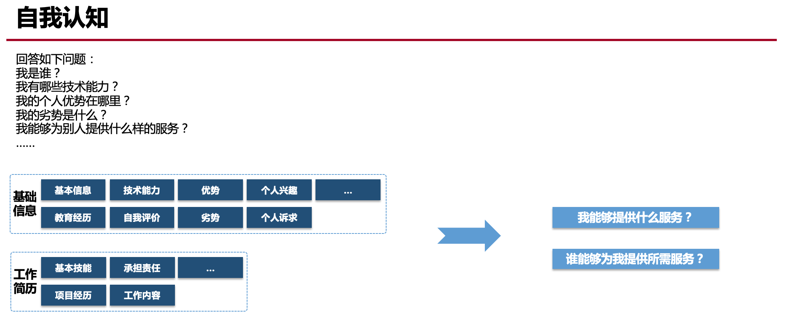

# 虎翎芳子
- 自我认知

## 基本信息
- 姓名：虎翎芳子
- 部门：`汉得中台·成都远程中心`

## 教育经历
- 毕业院校：成都东软学院
- 专业方向：软件工程
- 重要经历：
  * 2016.09 - 2017.06 新电信息科技（成都）实习
  * 2017.07 - 2018.04 成都我艾特你科技有限公司
  * 2018.04 - 2019.03 上海汉得信息技术股份有限公司-研发中心
  * 2019.03 - 至今 上海汉得信息技术股份有限公司-中台成都远程中心
- 相关证书：CET4、CET6

## 技术能力
- 精通：React、Vue、Antd、Ant Design Pro、lodash、HTML/HTML5
- 熟悉：ES6、Redux、Dva、Choerodon UI、Hzero UI、Mobx、react-router、node.js、Vuex、Axios、CSS、Less、Sass、stylelint、eslint、npm、Echarts、Gulp、Git/SVN、微信小程序开发
- 掌握：Angular、Webpack、yarn、lerna
- 兴趣：

## 自我评价
- S(Strengths)优势：开发经验比较丰富，参与过很多项目。例如猪齿鱼、HZERO等，对于很多常见问题有相应解决方案，积累了很多相应的专业技术知识，并乐于学习新知识形成知识体系。乐于探索。
- W(Weaknesses)劣势：对前端构建了解不深入，性能优化方面需要加强。
- O(Opportunities)机会：目前参与HZERO项目，希望在开发之余，研究项目的前端工程化。
- T(Threats)威胁：前端框架日新月异，发现并掌握当下的技术潮流，同时需要加深已掌握的知识，精力和时间都很有限，需要考虑该如何安排自己的时间。

## 项目信息
- 当前项目：Hzero
- 期望项目地：成都
- 出国意愿：无

## 其他
- 家乡：四川-广元
- 兴趣：手帐、日语
- 诉求：希望有时间学习前端工程化等自己感兴趣的方面，而不是完全在做开发。
