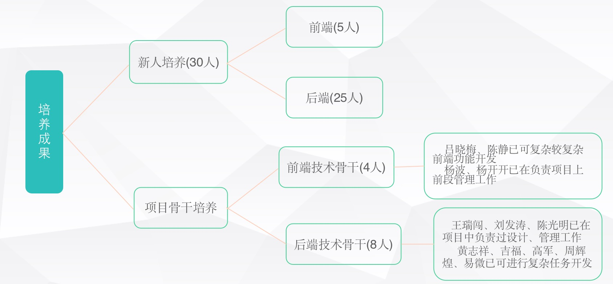

# 张建-项目信息

## 2018-08~2019-08 甄云SRM系统

- 客户简介
```
甄云科技做为汉得子公司携手中台基于HZERO框架开发自己的供应链管理系统SRM，作为老系统的升级改造也是今后的主打产品。并与京东合作开阔了广泛的市场。
```

- 项目介绍
```
SRM系统作为供应链系统，为客户提供企业注册、供应商管理、商城、采购、订单、支付、财务、发票、招投标、企业认证、企业监控等多种功能
```

- 主要角色
```
项目核心开发人员
技术负责人、组长
```

- 主要职责及工作
```
表设计、技术文档编写
任务拆分、工时预估、人员安排、风险管控
敏捷项目管理
新人培养、技术指导
代码质量管控、环境维护项目部署
核心代码编写
负责内容：
    供应商服务、平台服务、财务服务技术负责人。调查表模版、供应商生命周期、合作邀约、财务对账等模块开发。供应商导入ERP、风控、工作台、澄清涵、招标项目等模块表设计、技术设计。使用敏捷管理8-16人团队开发
```

- 工作成长

    管理能力:
```
    1. 带领两个小组实践敏捷管理，提升工作效率、风险管控，并取得良好成绩，获得部门颁发一等奖
    2. 实践任务拆分工时预估，给出比较准确的预估工时，便于整个产品发布迭代进度掌控。按时交付产出
    3. 团队建设，学习氛围营造。分享学习资料、书籍，提高专业技能，同时保持积极进去的心态，到工作中；针对成员安排学习任务；定期组织培训，增进大家互相了解
    4. 团队建设，团队凝聚力建设。定期组织大家聚餐，为忙碌的工作增加一点休闲时间，劳逸结合，同时也能促进团队成员归属感，让新成员能尽快融入团队；一起解决疑难复杂问题，增强团队协作意识，团队凝聚力，提高问题解决效率
    5. 大局观、领导力的培养
```
    文档能力:
```
    1. 根据产品故事需求，编写表设计文档、技术设计文档
    2. 编写基础知识文档、项目介绍文档给新人
```
    专业技术能力:
```
    1. 基于ServiceComb的分布式事务一致性解决方案
    2. 基础组件开发
    3. OAuth2认证学习
    4. SRM系统供应商、财务、寻源业务学习
```
    人员培养:
    

- 工作不足

```
对于工作中出现的无法抗拒的外部因素导致迭代延迟交付，无力解决，严重打乱开发进度
```

- 自我评价

```
在整个项目中带领8-16人团队积极努力工作，由于项目需求多，时间短，急需上线，因此大家时常牺牲周末及法定节假日工作，保证迭代能按时，保质保量的交付测试使用，并获得了部门颁发的一等奖
```