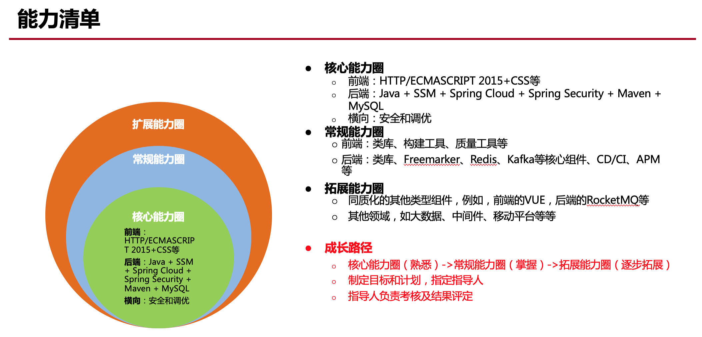

# 基本能力清单

## 能力指标
- 更新地址：[能力清单](https://docs.qq.com/sheet/DYlRzdW5YeHl4ckdv?c=E131E0B0)
- 更新周期：`每个季度更新一次`
- 负责人：`张建`

## 成长路径

## 提高规划
负责人负责在此处规划相关培训、考核计划及记录。
### 后端

#### 2019.09.19-2019.10.08
- 培训时间：2019.09.19-2019.10.08周末（具体时间视大家情况而定）
- 主讲人：张建
- 培训内容：
- 考核时间：2019.10.08晚
- 考核形式：题目
- 考核结果：

成员|成绩
---|---
张建|
吴星星|
李建波|

### 前端

## 更新日志
### 2019-9-11
成员|更新日志
---|---
刘明伟|
张建|后端更新培训考核计划
吴星星|
李建波|
王柯|
虎翎芳子|