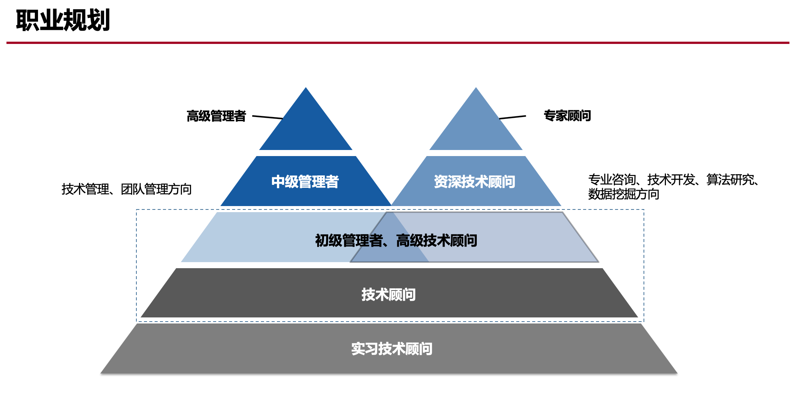
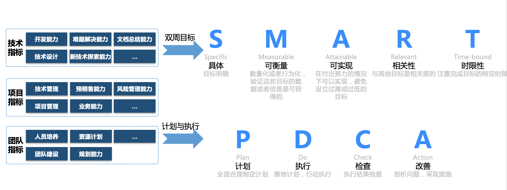

# 吴星星
- 职业路径

- 目标及计划制定原则

## 中长期目标（2019-09至2019-12）
从九月到今年年底，预计四个月的时间，系统学习springBoot和springCloud的整个体系。预计springBoot和springCloud各自花两个月时间

## 短期目标（两周-20190902~20190915）
springBoot的基本搭建，配置相关知识，以及日志集成和web开发相关知识

### 第一周
-   springBoot的环境准备并搭建简单的hello word 同时探索springBoot的启动流程
-   springBoot的配置文件的使用
-   总结对应文档

### 弟二周
-   springBoot集成主流的日志框架
-   springBoot web开发相关知识
-   总结对应文档