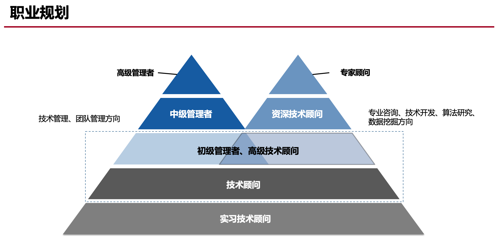

# 张建
- 职业路径

- 目标及计划制定原则

## 中长期目标（2019-09至2019-12）

- 完成对移动项目组HZEO框架培训，并形成对应文档放在文档平台。供大家学习参考
- 完成对K8s学习并基于文档发布平台搭建一套自动化部署流水线，同时学习猪齿鱼自动化部署

## 短期目标（两周-20190902~20190915）

- 完成代码规范、DDD介绍、开发流程介绍、IAM服务相关文档并培训
- 完成网关介绍文档、Oauth2介绍文档并培训
- 完成Kubernetes in Action 第三、四、五、六章学习

### 第一周

-   完成代码规范、DDD介绍、开发流程介绍、IAM服务相关文档并培训
-   完成Kubernetes in Action 第三、四学习

### 弟二周

-   完成网关介绍文档、Oauth2介绍文档并培训
-   完成Kubernetes in Action 第五、六章学习