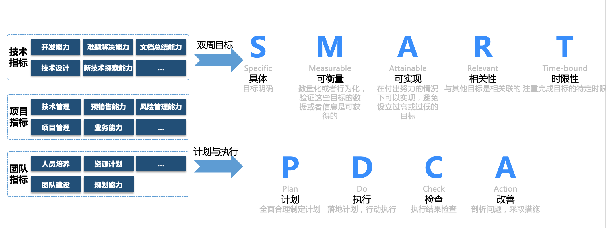

- 职业路径

- 目标及计划制定原则

## 中长期目标（半年度）
半年度规划，需要真实、可达；内容可参照职业规划部分的细分方案，按照自己的职业路径来。短期目标在其下面滚动。参照`SMART原则`。

## 短期目标（两周-20190826~20190909）
要求每两周制定一个短期目标，服务于中长期目标。其下管理两周的计划、进度、心得等等。参照`SMART原则`。

### 第二周
每周的计划、进度、心得等等。参照`PDCA原则`。

### 第一周
