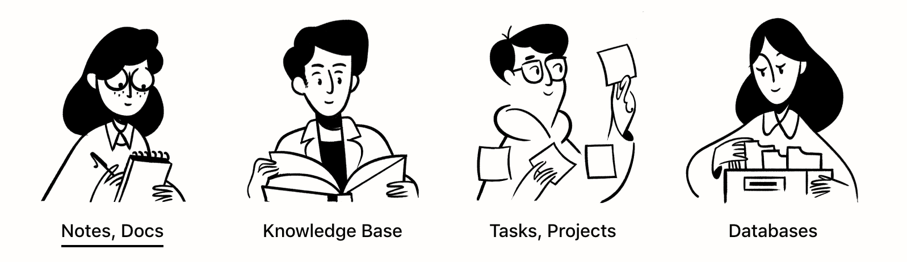

## 2019-09-11
### 分享主题：Notion使用分享
#### 通过这次分享，你能获得什么？
- Notion是什么？
- 为什么要使用Notion？
- 如何注册登录使用 Notion？
- 快速搭建一个属于个人的工作空间；
- Notion 使用过程中的效率 Tips。

### Notion是什么 && 为什么要使用Notion

Notion是一款笔记类的应用。

我们使用电子笔记而不用手写笔记一个很重要的原因就是要**建立个人知识体系**，因为今天人脑远不足以应付接收到的巨大的知识量，那么使用电子笔记软件构建自己的知识体系便成为了现代知识工作者的一个重要组成部分。

从老牌oneNote、印象笔记，到比较新的Bear，大家或多或少的使用了它们，来建立自己的生活、工作知识体系。但是这些软件总有一些**痛点**让人难受。那么Notion带来了什么？

> Notion = Google docs + Evernote + Trello（看板） + Confluence（企业知识管理） + Github + Wiki + Quip（团队协作）

### 如何注册登录使用 Notion

官网注册，推荐用国内邮箱注册。

可通过邀请链接注册，也可以直接注册。账户可销毁。

### 快速搭建一个属于个人的工作空间

实际操作示例。

### Notion 使用过程中的效率 Tips

- 快速创建Link

### 优质视频学习资源
- [「Notion」新手向！从零开始快速搭建自己的小家(工作区)](https://www.bilibili.com/video/av46349671)
- [如何使用「Notion」记日记，管理待办事项，以及database间的联动](https://www.bilibili.com/video/av44466074)

### 参考资料
- [notion 5分钟入个门](https://www.jianshu.com/p/c030e3dce93d)
- [待办、笔记、协作样样精通，这个七合一全能型 App 究竟有多好用？](https://www.ifanr.com/app/1157944)